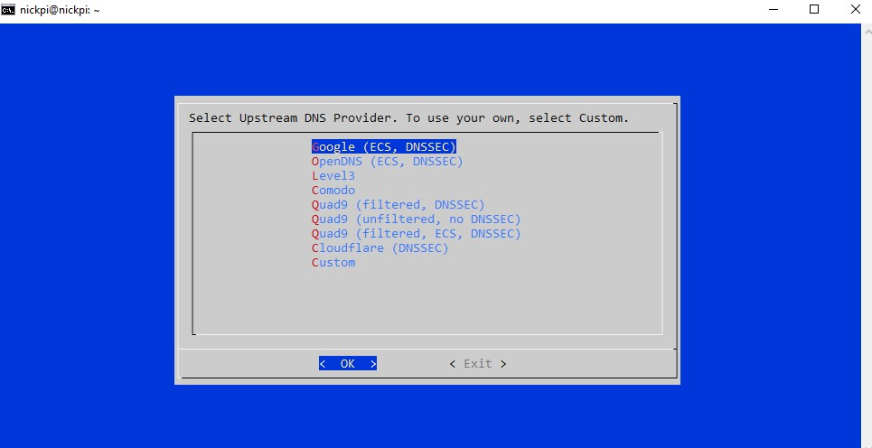
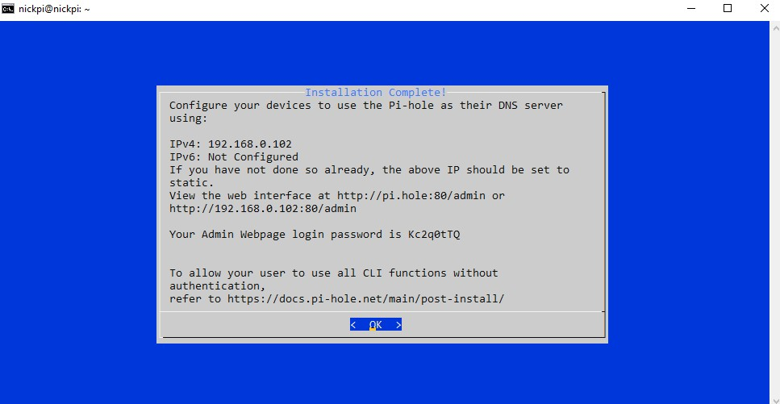
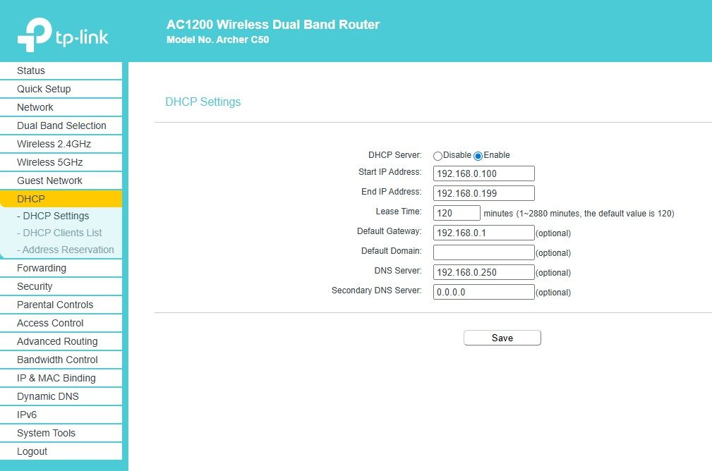
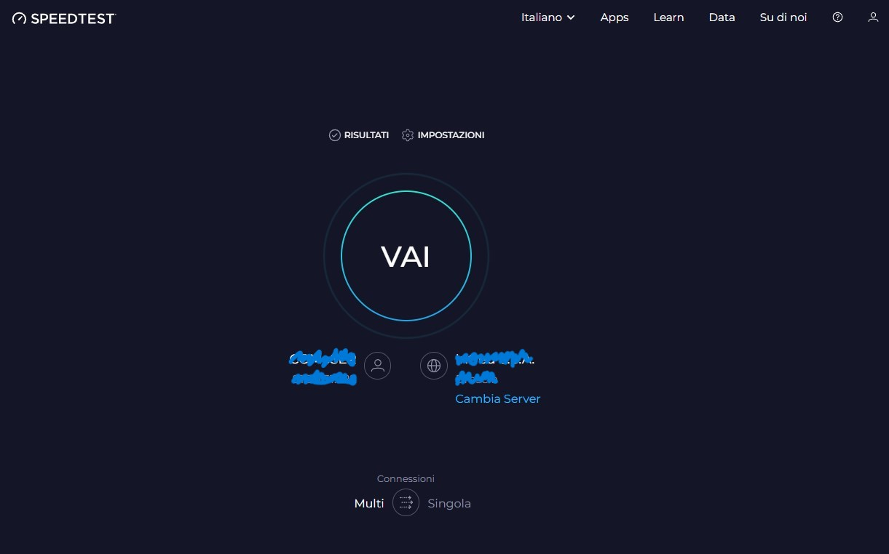
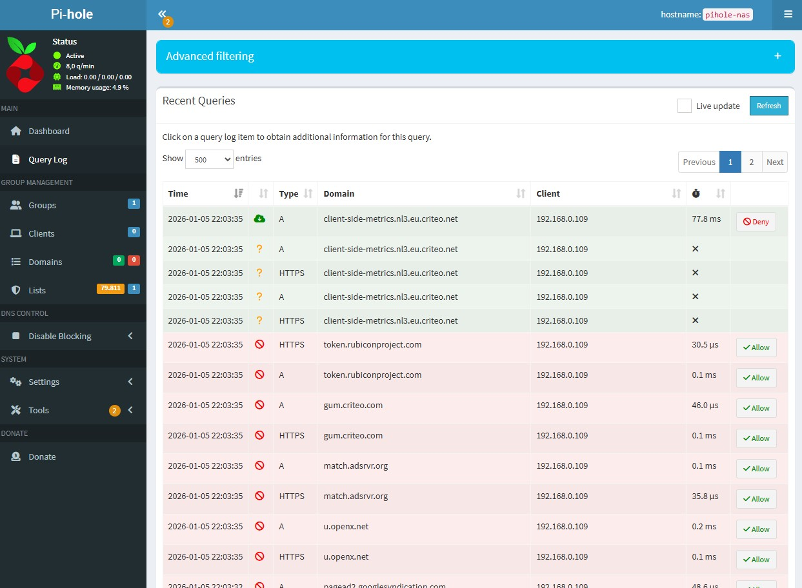

# Pi-hole - DNS Sinkhole per il blocco di pubblicita' e tracking

Questa guida documenta l'installazione di Pi-hole su Docker con rete MacVLAN, la configurazione del router per usarlo come DNS primario, e i problemi reali che ho incontrato (spoiler: il conflitto della porta 80 con OpenMediaVault).

---

## Teoria: Come funziona il blocco DNS

### Il processo di risoluzione DNS

Quando digiti `www.google.com` nel browser, il sistema operativo deve tradurre quel nome in un indirizzo IP. Ecco la catena di risoluzione:

```
Browser → Cache locale → File hosts → Server DNS configurato → Root DNS → TLD DNS → Authoritative DNS
```

1. Il browser chiede al sistema operativo: "Qual e' l'IP di `www.google.com`?"
2. Il SO controlla la cache locale e il file `/etc/hosts` (o `C:\Windows\System32\drivers\etc\hosts`)
3. Se non trova la risposta, invia una **query DNS** al server configurato (tipicamente il router, che a sua volta inoltra al DNS del provider)
4. Il DNS ricorsivo risolve il nome attraverso la gerarchia (root → `.com` → `google.com`) e restituisce l'IP

### Risoluzione ricorsiva vs iterativa

Questa distinzione e' fondamentale per capire dove Pi-hole si inserisce e perche' funziona.

**Ricorsiva** - il client chiede al suo DNS server e si aspetta la risposta finale:

```
[Il tuo PC] ── "Qual e' l'IP di www.google.com?" ──► [Pi-hole / DNS ricorsivo]
[Il tuo PC] ◄── "142.250.180.4" ───────────────────── [Pi-hole / DNS ricorsivo]
```

Il client fa **una sola domanda** e riceve la risposta completa. Tutto il lavoro lo fa il resolver ricorsivo (Pi-hole o il DNS del provider).

**Iterativa** - il resolver ricorsivo interroga la gerarchia DNS un livello alla volta:

```
Pi-hole (resolver ricorsivo)                        Server DNS
        │
        ├── "Dove trovo www.google.com?" ──────────► [Root Server (.)]
        │◄── "Non lo so, chiedi a .com: 192.5.6.30" ─┘
        │
        ├── "Dove trovo www.google.com?" ──────────► [TLD .com (192.5.6.30)]
        │◄── "Non lo so, chiedi a google.com:       ─┘
        │     216.239.32.10"
        │
        ├── "Qual e' l'IP di www.google.com?" ─────► [Authoritative google.com]
        │◄── "142.250.180.4, TTL=300" ──────────────┘
        │
        └── Salva in cache per 300 secondi
```

La gerarchia DNS ha 3 livelli:

| Livello | Esempio | Quanti ne esistono | Cosa contengono |
|---|---|---|---|
| **Root (.)** | `a.root-servers.net` ... `m.root-servers.net` | 13 cluster (anycast, centinaia di server fisici) | Puntatori ai TLD server |
| **TLD** | Server di `.com`, `.org`, `.it`, `.net` | Uno per ogni TLD | Puntatori agli authoritative server dei domini |
| **Authoritative** | Server di `google.com` | Uno per ogni dominio registrato | I record DNS effettivi (IP, MX, etc.) |

### I Record DNS: tipi e casi d'uso pratici

Ogni dominio ha diversi tipi di record. Puoi interrogarli con `dig` (installato su quasi tutti i sistemi Linux):

```bash
# Record A (IPv4) - il piu' comune, quello che Pi-hole blocca
dig A www.google.com +short
# 142.250.180.4

# Record AAAA (IPv6)
dig AAAA www.google.com +short
# 2a00:1450:4002:402::2004

# Record MX (Mail Exchange) - dove inviare le email per quel dominio
dig MX google.com +short
# 10 smtp.google.com.

# Record NS (Name Server) - chi e' l'autorita' per quel dominio
dig NS google.com +short
# ns1.google.com.
# ns2.google.com.

# Record CNAME (alias) - un nome che punta a un altro nome
dig CNAME www.github.com +short
# github.github.io.

# Record TXT - testo libero, usato per SPF, DKIM, verifica proprieta'
dig TXT google.com +short
# "v=spf1 include:_spf.google.com ~all"

# Record SOA (Start of Authority) - metadati della zona DNS
dig SOA google.com +short
# ns1.google.com. dns-admin.google.com. 2024010100 900 900 1800 60
```

| Record | Tipo | Contenuto | Uso pratico |
|---|---|---|---|
| `A` | Indirizzo IPv4 | `142.250.180.4` | Traduzione nome → IP (il record che Pi-hole blocca rispondendo `0.0.0.0`) |
| `AAAA` | Indirizzo IPv6 | `2a00:1450:...` | Come A, ma per IPv6 (Pi-hole blocca anche questi con `::`) |
| `CNAME` | Alias (Canonical Name) | `github.github.io.` | Un dominio che punta a un altro dominio (il resolver segue la catena) |
| `MX` | Mail Exchange | `10 smtp.google.com.` | Indica quale server riceve le email. Il numero e' la priorita' (piu' basso = preferito) |
| `NS` | Name Server | `ns1.google.com.` | Indica i server autoritativi per il dominio |
| `TXT` | Testo libero | `"v=spf1 ..."` | Verifica proprieta' dominio, SPF (anti-spam), DKIM, DMARC |
| `SOA` | Start of Authority | serial, refresh, retry... | Metadati della zona DNS: serial number, intervalli di refresh, TTL negativo |
| `PTR` | Reverse DNS | `hostname.example.com.` | Risoluzione inversa: IP → nome. Usato per verifiche anti-spam e log leggibili |
| `SRV` | Service | `_sip._tcp.example.com.` | Indica dove trovare un servizio specifico (porta, protocollo, peso) |

### Anatomia di un pacchetto DNS

Ogni query DNS viaggia tipicamente su **UDP porta 53** (TCP solo se la risposta supera 512 byte o per zone transfer). Il pacchetto ha questa struttura:

```
+--+--+--+--+--+--+--+--+--+--+--+--+
|          Header (12 byte)           |
+--+--+--+--+--+--+--+--+--+--+--+--+
|      Question Section               |  ← "Cosa stai chiedendo?"
+--+--+--+--+--+--+--+--+--+--+--+--+
|      Answer Section                  |  ← "Ecco la risposta" (vuota nelle query)
+--+--+--+--+--+--+--+--+--+--+--+--+
|      Authority Section               |  ← "Chi e' l'autorita' per questo dominio"
+--+--+--+--+--+--+--+--+--+--+--+--+
|      Additional Section              |  ← Record extra utili (es. IP del NS)
+--+--+--+--+--+--+--+--+--+--+--+--+
```

**Header (12 byte fissi):**

| Campo | Bit | Scopo |
|---|---|---|
| ID | 16 | Identificativo della transazione. La risposta ha lo stesso ID della query - cosi' il client sa a quale domanda corrisponde |
| QR | 1 | 0 = query, 1 = response |
| Opcode | 4 | 0 = standard query, 1 = inverse query, 2 = server status |
| AA | 1 | Authoritative Answer - il server che risponde e' l'autorita' per il dominio |
| TC | 1 | Truncated - la risposta e' stata troncata (supera 512 byte UDP), il client deve riprovare su TCP |
| RD | 1 | Recursion Desired - il client chiede al server di risolvere ricorsivamente |
| RA | 1 | Recursion Available - il server supporta la risoluzione ricorsiva |
| RCODE | 4 | Codice di risposta: 0=NOERROR, 3=NXDOMAIN (dominio non esiste), 2=SERVFAIL |

Puoi vedere un pacchetto DNS reale con `dig` in modalita' verbosa:

```bash
dig www.google.com +noall +answer +comments
```

```
;; Got answer:
;; ->>HEADER<<- opcode: QUERY, status: NOERROR, id: 41532
;; flags: qr rd ra; QUERY: 1, ANSWER: 1, AUTHORITY: 0, ADDITIONAL: 1

;; ANSWER SECTION:
www.google.com.    300    IN    A    142.250.180.4
│                   │      │    │    │
│                   │      │    │    └── L'indirizzo IP
│                   │      │    └── Tipo di record
│                   │      └── Classe (IN = Internet)
│                   └── TTL: 300 secondi di cache
└── Il dominio richiesto
```

**Come Pi-hole sfrutta questo:** Quando Pi-hole blocca un dominio (es. `ads.doubleclick.net`), risponde con un pacchetto DNS valido ma con `ANSWER: 0.0.0.0` (o `NXDOMAIN`). Il browser riceve una risposta DNS formalmente corretta, ma l'IP nullo non porta da nessuna parte - la richiesta HTTP all'ad server non parte mai. Per il browser, e' come se il server di pubblicita' non esistesse

### Dove si inserisce Pi-hole

Pi-hole si posiziona come **DNS server locale**. Tutte le query DNS della rete passano attraverso di lui:

```
Dispositivo → Pi-hole (192.168.0.250) → Il dominio e' in blocklist?
                                          ├── SI → Risponde 0.0.0.0 (NXDOMAIN / null)
                                          └── NO → Inoltra al DNS upstream (8.8.8.8, 1.1.1.1)
```

Quando un'app o una pagina web tenta di caricare una risorsa da un dominio di advertising o tracking (es. `ads.doubleclick.net`, `pixel.facebook.com`), Pi-hole risponde con un indirizzo nullo. La risorsa non viene mai scaricata - la pubblicita' semplicemente non appare.

**Vantaggi rispetto ai browser ad-blocker (uBlock Origin, AdBlock):**

| | Pi-hole (DNS-level) | Browser extension |
|---|---|---|
| Protegge tutti i dispositivi | Si (TV, IoT, smartphone, console) | Solo il browser configurato |
| Blocca tracking app | Si (le app usano DNS) | No (solo traffico browser) |
| Impatto performance | Nessuno (il DNS e' piu' veloce) | Leggero overhead per pagina |
| Bypassabile con DoH | Si (vedi sotto) | No |
| Blocca in-video ads (YouTube) | No (stessi domini del contenuto) | Parzialmente |

---

## Il Problema: Conflitto della Porta 80

OpenMediaVault (il nostro NAS) occupa la porta 80 per la sua interfaccia web. Anche Pi-hole richiede la porta 80 per la dashboard. Inoltre, Pi-hole necessita della porta 53 (DNS), spesso occupata da `systemd-resolved`.

### Cosa NON fare

**Non installare Pi-hole direttamente sull'host** con il comando che si trova ovunque online:

```bash
# ⚠️ NON ESEGUIRE QUESTO COMANDO ⚠️
curl -sSL https://install.pi-hole.net | bash
```

Questo installa Pi-hole "bare metal" (direttamente sul sistema operativo), causando:

- Conflitto sulla porta 80 con OMV (nginx)
- Conflitto sulla porta 53 con `systemd-resolved`
- Installazione di una seconda istanza di `lighttpd` che interferisce con nginx di OMV
- Doppia gestione DNS che crea confusione

Se per errore l'avessi fatto, ecco cosa vedresti - queste sono schermate dell'installer bare metal che **non** va usato nel nostro setup:





### La soluzione: Docker + MacVLAN

Invece di combattere per le porte, diamo a Pi-hole un **indirizzo IP dedicato** sulla rete locale usando il driver MacVLAN. Il container Pi-hole appare come un dispositivo fisico separato con tutte le porte libere:

- Raspberry Pi (host/NAS): `192.168.0.102` → porta 80 = OMV
- Pi-hole (container): `192.168.0.250` → porta 80 = dashboard Pi-hole, porta 53 = DNS

Nessun conflitto, nessun port mapping.

---

## Configurazione di rete

| Componente | IP | Ruolo |
|---|---|---|
| Router (Gateway) | `192.168.0.1` | DHCP, routing, NAT |
| Raspberry Pi (Host) | `192.168.0.102` | NAS (OMV), Docker host |
| Pi-hole (Container) | `192.168.0.250` | DNS sinkhole |
| Subnet | `192.168.0.0/24` | Rete locale |
| Interfaccia fisica RPi5 | `end0` | Ethernet (su RPi5 Bookworm e' `end0`, non `eth0`) |

> **L'IP 192.168.0.250 deve essere fuori dal range DHCP del router.** Se il router assegna IP da `.100` a `.200`, il `.250` e' sicuro. Altrimenti, rischi che il router assegni lo stesso IP a un altro dispositivo, causando conflitti ARP.

---

## Installazione Passo-Passo

### 1. Struttura directory

```bash
mkdir -p ~/pihole
cd ~/pihole
```

### 2. Docker Compose

Creare il file `docker-compose.yml`:

```yaml
version: "3"

services:
  pihole:
    container_name: pihole
    image: pihole/pihole:latest
    hostname: pihole-nas
    domainname: lan
    networks:
      pihole_net:
        ipv4_address: 192.168.0.250
    ports:
      - "53:53/tcp"
      - "53:53/udp"
      - "80:80/tcp"
    environment:
      TZ: 'Europe/Rome'
      FTLCONF_LOCAL_IPV4: 192.168.0.250
      # La password la impostiamo dopo da CLI per non lasciarla in chiaro nel file
    volumes:
      - './etc-pihole:/etc/pihole'
      - './etc-dnsmasq.d:/etc/dnsmasq.d'
    cap_add:
      - NET_ADMIN
    restart: unless-stopped

networks:
  pihole_net:
    driver: macvlan
    driver_opts:
      parent: end0  # Verificare con 'ip link' - su RPi5 Bookworm e' end0, su RPi4 e' eth0
    ipam:
      config:
        - subnet: 192.168.0.0/24
          gateway: 192.168.0.1
          ip_range: 192.168.0.248/29  # Range .248-.255 riservato a Docker MacVLAN
```

**Spiegazione dei parametri di rete MacVLAN:**

- `parent: end0`: l'interfaccia fisica su cui Docker crea l'interfaccia virtuale MacVLAN
- `ip_range: 192.168.0.248/29`: un piccolo range di 8 IP (`.248` a `.255`) riservato ai container MacVLAN. Questo evita che Docker assegni IP in conflitto con il DHCP del router
- `cap_add: NET_ADMIN`: necessario perche' Pi-hole deve poter modificare la configurazione di rete (binding su porta 53, DHCP se abilitato)

### 3. Avvio e configurazione password

```bash
# Avvio in background
docker compose up -d

# Imposta la password della dashboard
docker exec -it pihole pihole setpassword tua_password_sicura
```


---

## Configurazione Router e Client

### Configurazione del router come relay DNS

Affinche' **tutti** i dispositivi della rete usino Pi-hole automaticamente, devi dire al router di distribuire l'IP del Pi-hole come DNS tramite DHCP.

Sul router (TP-Link Archer C50 → DHCP → DHCP Settings):

- **Primary DNS**: `192.168.0.250` (IP del Pi-hole)
- **Secondary DNS**: due opzioni:
  - **Hardcore (blocco al 100%)**: lasciare vuoto o `0.0.0.0`. Se Pi-hole va giu', niente Internet - ma nessuna query bypassa il blocco
  - **Failover**: `1.1.1.1` (Cloudflare) o `8.8.8.8` (Google). Se Pi-hole va giu', Internet continua a funzionare, ma alcune query potrebbero bypassare il filtro anche quando Pi-hole e' attivo (il SO potrebbe preferire il DNS secondario per velocita')



### Perche' i dispositivi non aggiornano subito il DNS

Dopo aver modificato il DNS sul router, i dispositivi non lo usano immediatamente. Il motivo e' il **lease DHCP**: ogni dispositivo ha un "contratto" con il router che include l'indirizzo IP assegnato e il DNS. Questo contratto ha una durata (tipicamente 24 ore). Fino al rinnovo, il dispositivo continua a usare il vecchio DNS.

**Soluzioni:**
- Riavviare il Wi-Fi/Ethernet sul dispositivo (forza un nuovo lease)
- Oppure, su Windows: `ipconfig /release && ipconfig /renew`
- Oppure, su Linux/macOS: `sudo dhclient -r && sudo dhclient`

### Il problema del DNS-over-HTTPS (DoH)

**Attenzione critica:** I browser moderni (Chrome, Edge, Firefox, Brave) possono usare **DNS-over-HTTPS (DoH)**, che invia le query DNS direttamente ai server del browser (es. `dns.google`, `cloudflare-dns.com`) bypassando completamente il DNS del sistema operativo e quindi Pi-hole.

Se vedi ancora pubblicita' dopo la configurazione, controlla:

**Chrome/Edge:** Impostazioni → Privacy e sicurezza → Sicurezza → **Disattiva "Usa DNS sicuro"**




---

## Verifica del funzionamento

### Dashboard Pi-hole

Accedere a `http://192.168.0.250/admin` e verificare:

- **Total Queries**: il numero deve crescere (ogni dispositivo fa decine di query DNS al minuto)
- **Queries Blocked**: se e' 0 dopo diversi minuti, qualcosa non funziona
- **Percentage Blocked**: tipicamente tra il 15% e il 40% del traffico DNS e' ads/tracking

### Query Log

La sezione **Query Log** mostra ogni singola query DNS in tempo reale:



Da qui puoi vedere:
- Quale dispositivo ha fatto la query (colonna **Client**)
- Quale dominio e' stato richiesto
- Se e' stato bloccato (rosso) o permesso (verde)
- Il tempo di risposta in millisecondi

### Test con Speedtest

Un test pratico: visita un sito con molte pubblicita' (es. speedtest.net) e osserva la differenza:


Dopo aver configurato Pi-hole come DNS, le pubblicita' scompariranno dai siti web. Le aree che ospitavano ads appariranno come spazi vuoti o non verranno caricate affatto.

---

## Troubleshooting

### "I comandi `pihole` non funzionano dal terminale del Pi"

I comandi Pi-hole (`pihole -t`, `pihole status`, ecc.) sono installati **dentro** il container, non sull'host. Dal terminale del Raspberry:

```bash
# Corretto - esegui il comando dentro il container
docker exec -it pihole pihole status

# Errato - il binario non esiste sull'host
pihole status  # Command not found
```

### La dashboard non e' raggiungibile

Verifica che il container sia in esecuzione e che l'IP MacVLAN sia attivo:

```bash
docker ps | grep pihole
docker inspect pihole | grep IPAddress
ping 192.168.0.250  # Da un ALTRO dispositivo (non dal Pi - vedi sotto)
```

### Il Raspberry Pi non raggiunge Pi-hole

Per design di sicurezza del kernel Linux, l'host (Raspberry Pi) **non puo' comunicare** con i container MacVLAN sulla stessa interfaccia (vedi sezione VLAN per la spiegazione tecnica). Questo non e' un bug - e' una feature di sicurezza.

**Conseguenza pratica:** Il Raspberry Pi stesso non puo' usare Pi-hole come DNS. Per un server headless, questo non e' un problema - il Pi non naviga su Internet.

---

## Deep Dive: Pi-hole FTL Engine e gravity.db

### FTL (Faster Than Light) - il cuore di Pi-hole

Pi-hole non e' un semplice file `/etc/hosts` gigante. Il suo motore DNS si chiama **FTL (Faster Than Light)** ed e' un fork di `dnsmasq` con un layer di analisi e logging integrato.

Come funziona una query:

```
Client (192.168.0.109) → query DNS "ads.doubleclick.net"
     │
     ▼
[Pi-hole FTL riceve la query sulla porta 53]
     │
     ├── 1. Controlla la cache locale (risposte gia' note)
     │       → HIT: risponde immediatamente (tempo: ~0.1ms)
     │       → MISS: prosegue ▼
     │
     ├── 2. Controlla la whitelist (domini esplicitamente permessi)
     │       → Se presente: inoltra al DNS upstream
     │
     ├── 3. Controlla gravity.db (il database dei domini bloccati)
     │       → MATCH: risponde con 0.0.0.0 / :: (blocco)
     │       → NO MATCH: prosegue ▼
     │
     ├── 4. Controlla regex/wildcard blocklist
     │       → MATCH: blocca
     │       → NO MATCH: prosegue ▼
     │
     └── 5. Inoltra la query al DNS upstream (8.8.8.8, 1.1.1.1)
             → Riceve la risposta, la mette in cache, la restituisce al client
```

### gravity.db - il database SQLite delle blocklist

Tutte le blocklist vengono scaricate, deduplicate e archiviate in un database SQLite locale:

```bash
# Dentro il container Pi-hole:
docker exec -it pihole sqlite3 /etc/pihole/gravity.db

# Contare i domini bloccati:
sqlite3> SELECT COUNT(*) FROM gravity;
# 79811

# Vedere le blocklist configurate:
sqlite3> SELECT address, enabled, number FROM adlist;
# https://raw.githubusercontent.com/StevenBlack/hosts/master/hosts|1|79811

# Cercare un dominio specifico:
sqlite3> SELECT * FROM gravity WHERE domain = 'ads.doubleclick.net';
```

**Struttura delle tabelle principali:**

| Tabella | Contenuto |
|---|---|
| `gravity` | Tutti i domini bloccati (union di tutte le blocklist) |
| `adlist` | URL delle blocklist con stato enabled/disabled |
| `domainlist` | Whitelist e blacklist manuali (type 0 = whitelist, type 1 = blacklist) |
| `client` | Client con policy personalizzate |
| `domain_audit` | Domini segnalati per revisione |

### Regex e Wildcard Blocking

Oltre alle blocklist statiche, Pi-hole supporta pattern matching:

```bash
# Esempio: bloccare TUTTI i sottodomini di tracking
# Nella dashboard → Domains → RegEx filter:
(^|\.)tracking\..*$

# Bloccare qualsiasi dominio che contiene "analytics":
.*analytics.*

# Bloccare domini con pattern specifici (telemetria Microsoft):
(^|\.)telemetry\.microsoft\.com$
(^|\.)vortex\.data\.microsoft\.com$
```

I regex vengono compilati all'avvio di FTL e valutati su ogni query - troppi regex complessi possono aumentare la latenza DNS.

### DNSSEC (Domain Name System Security Extensions)

Pi-hole supporta la validazione **DNSSEC**, che verifica l'autenticita' delle risposte DNS tramite firma crittografica.

**Il problema che DNSSEC risolve:** il protocollo DNS e' nato senza autenticazione. Un attaccante (DNS spoofing, cache poisoning) puo' restituire risposte false, reindirizzando `www.banca.it` verso un server malevolo. DNSSEC aggiunge firme digitali alle risposte DNS che il resolver puo' verificare.

**Come funziona:**

1. Il dominio (es. `example.com`) firma i suoi record DNS con una chiave privata
2. La chiave pubblica corrispondente e' pubblicata nel DNS stesso (record DNSKEY)
3. Il resolver verifica la firma: se corrisponde, la risposta e' autentica; se non corrisponde, la risposta viene scartata

Per abilitare DNSSEC in Pi-hole: **Settings → DNS → Use DNSSEC** (checkbox).

> **Nota:** DNSSEC aggiunge una leggera latenza alla prima query (verifica della chain of trust). Se il DNS upstream non supporta DNSSEC (o il dominio non e' firmato), la query passa normalmente senza validazione - DNSSEC non rompe i domini non firmati.

---

## Perche' Pi-hole e non le alternative

### Pi-hole vs AdGuard Home vs Blocky vs NextDNS

| Aspetto | Pi-hole | AdGuard Home | Blocky | NextDNS |
|---|---|---|---|---|
| **Architettura** | dnsmasq + FTL (C) | CoreDNS custom (Go) | Go, config YAML | Cloud SaaS |
| **Self-hosted** | Si | Si | Si | **No** (server NextDNS) |
| **Interfaccia** | Web (PHP/lighttpd) | Web (integrata, no dipendenze) | Nessuna (solo config file) | Web (cloud) |
| **DNS-over-HTTPS (DoH)** | No nativo (richiede proxy) | **Si** (nativo, server e client) | **Si** (nativo) | **Si** (cloud) |
| **DNS-over-TLS (DoT)** | No nativo | **Si** (nativo) | **Si** | **Si** |
| **Filtro per client** | Parziale (group management) | **Si** (regole per client) | **Si** | **Si** |
| **DHCP server** | Si | Si | No | No |
| **Risorse (RAM)** | ~120MB | ~70MB | ~20MB | 0 (cloud) |
| **RPi ARM64** | Si | Si | Si | N/A (cloud) |
| **Blocklist** | Gravity (SQLite, 80k+ domini) | Filtri stile AdBlock (piu' flessibili) | Lista link in YAML | Preset + custom |
| **Community** | Enorme (piu' vecchio, piu' documentato) | Grande (in crescita rapida) | Piccola (nichia) | Media |
| **Costo** | $0 | $0 | $0 | $0 (300k query/mese) / $20/anno |

### AdGuard Home: l'alternativa principale — quando preferirla

AdGuard Home ha due vantaggi che Pi-hole non ha: **DoH/DoT nativo** (il traffico DNS tra AdGuard e l'upstream e' cifrato senza proxy aggiuntivi) e **filtri per client** (puoi applicare blocklist diverse a dispositivi diversi — es. blocklist piu' aggressiva per i figli, piu' permissiva per il tuo PC).

**Installazione su Docker (stesse porte di Pi-hole):**

```bash
docker run -d \
    --name adguardhome \
    --restart=always \
    --net macvlan_lan \
    --ip 192.168.0.250 \
    -v /home/pi/adguard/work:/opt/adguardhome/work \
    -v /home/pi/adguard/conf:/opt/adguardhome/conf \
    adguard/adguardhome

# Setup wizard su http://192.168.0.250:3000 (primo avvio)
# Dopo il setup, dashboard su http://192.168.0.250:80
```

**Perche' ho scelto Pi-hole e non AdGuard Home:**

1. **Community e documentazione**: Pi-hole e' il progetto piu' maturo, con migliaia di guide e troubleshooting disponibili. Per un progetto educativo, la documentazione conta
2. **Integrazione Wazuh**: Pi-hole scrive log in formato standard syslog (`/var/log/pihole.log`), facilmente ingeribili da Wazuh. AdGuard Home usa un formato proprietario che richiede decoder custom
3. **FTL engine**: Il motore FTL di Pi-hole e' scritto in C e gestisce le query con latenza inferiore al millisecondo. AdGuard Home in Go e' comunque veloce, ma FTL e' piu' efficiente su hardware limitato come il Pi

**Quando scegliere AdGuard Home:** Se hai bisogno di DoH/DoT nativo (senza configurare un proxy come `cloudflared`), o se vuoi regole diverse per dispositivi diversi (es. bambini vs adulti).

### Blocky: l'alternativa minimale per chi vuole solo YAML

Blocky e' per chi trova Pi-hole e AdGuard Home "troppi" — nessuna interfaccia web, solo un file YAML:

```bash
# Installazione via Docker
docker run -d \
    --name blocky \
    --restart=always \
    -p 53:53/udp -p 53:53/tcp \
    -v /home/pi/blocky/config.yml:/app/config.yml \
    spx01/blocky

# config.yml
cat > /home/pi/blocky/config.yml <<'EOF'
upstream:
  default:
    - 1.1.1.1
    - 8.8.8.8
blocking:
  blackLists:
    ads:
      - https://raw.githubusercontent.com/StevenBlack/hosts/master/hosts
  clientGroupsBlock:
    default:
      - ads
port: 53
httpPort: 4000
EOF
```

~20MB di RAM, nessuna dipendenza, configurazione dichiarativa. Ideale per chi preferisce Git + YAML a dashboard web.

### Domande che un analista si farebbe

**"DoH (DNS-over-HTTPS) rende Pi-hole inutile?"**

Parzialmente. Se un dispositivo usa DoH direttamente (Firefox con DoH abilitato verso Cloudflare), le query DNS **bypassano completamente Pi-hole** perche' viaggiano su HTTPS porta 443, non su DNS porta 53.

Mitigazioni:
1. **Bloccare gli IP dei resolver DoH noti** su UFW:
```bash
# Blocca i principali resolver DoH (forza i dispositivi a usare Pi-hole)
sudo ufw deny out to 1.1.1.1 port 443 comment "Block Cloudflare DoH"
sudo ufw deny out to 8.8.8.8 port 443 comment "Block Google DoH"
sudo ufw deny out to 9.9.9.9 port 443 comment "Block Quad9 DoH"
```
2. **Disabilitare DoH nei browser** via policy di gruppo (enterprise) o configurazione manuale
3. **Usare Pi-hole stesso come resolver DoH** con `cloudflared` come proxy upstream

**"Un ad-blocker DNS basta per la privacy?"**

No. Il blocco DNS previene il caricamento di risorse da domini noti di tracking, ma non protegge da:
- **Fingerprinting del browser**: il server identifica il dispositivo dalle caratteristiche del browser (canvas, WebGL, font installati) senza cookie
- **Tracking first-party**: se `example.com` traccia i suoi utenti sul proprio dominio, Pi-hole non lo blocca (blocca solo domini terzi)
- **Tracking a livello di app**: molte app mobile usano SDK di tracking con IP hardcoded, non risolvibili via DNS

Per una protezione completa serve: Pi-hole (DNS) + uBlock Origin (browser) + VPN (nasconde IP) + hardening browser (Firefox con resistFingerprinting).

---

## Sviluppi futuri

La struttura MacVLAN permette di aggiungere altri container con IP dedicati sulla rete locale, semplicemente modificando l'indirizzo IP nel Docker Compose:

| Servizio | IP dedicato | Porta |
|---|---|---|
| Pi-hole | 192.168.0.250 | 80, 53 |
| Honeypot | 192.168.0.251 | 2222, 2223 |
| Home Assistant | 192.168.0.252 | 8123 |

---

Prossimo step: [Honeypot](../Honeypot/) - deployment di Cowrie per catturare attaccanti.
