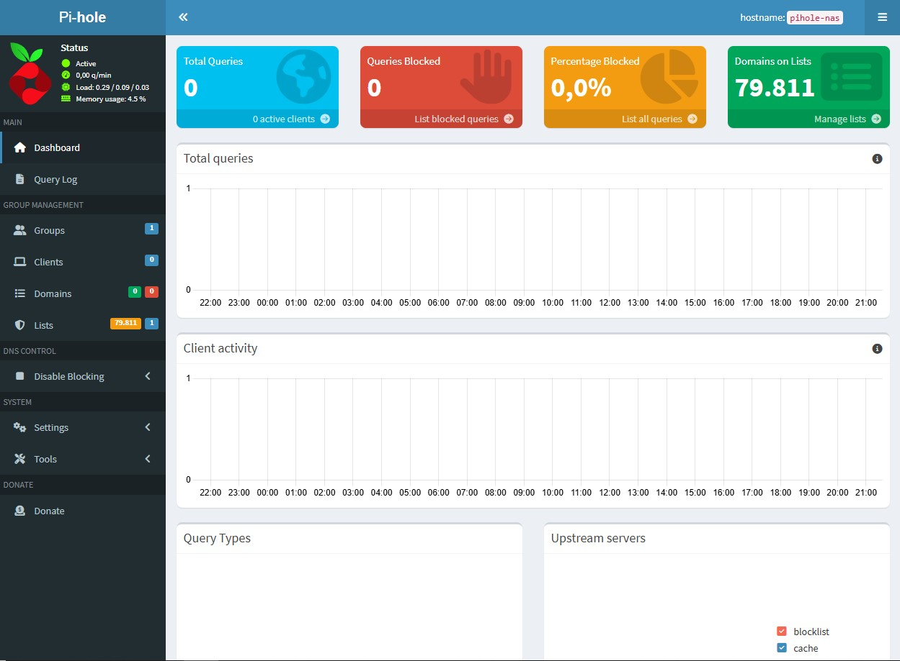
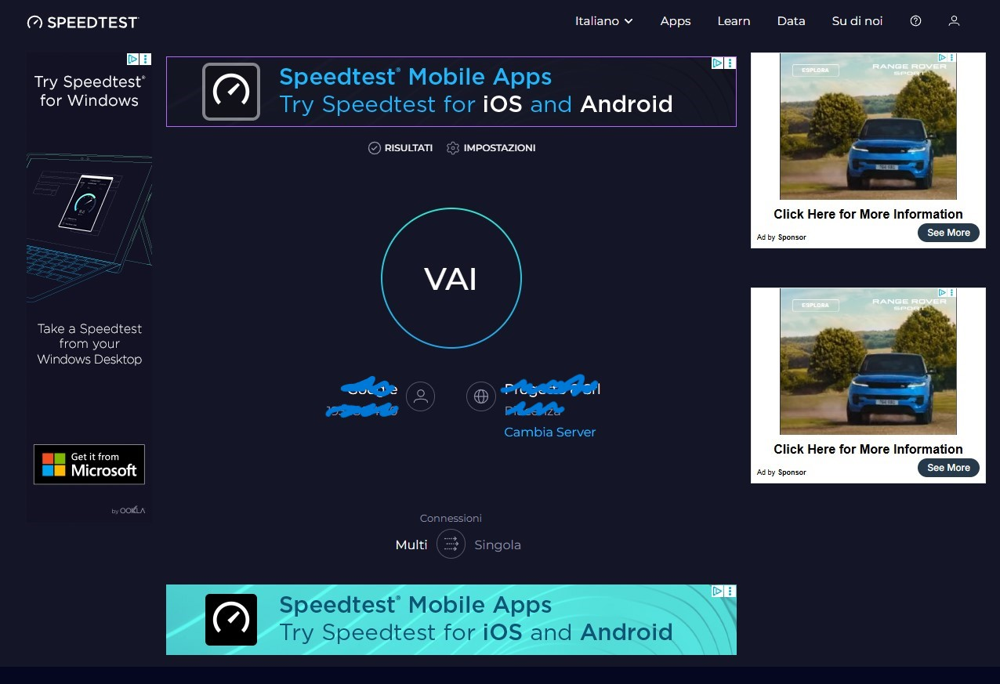
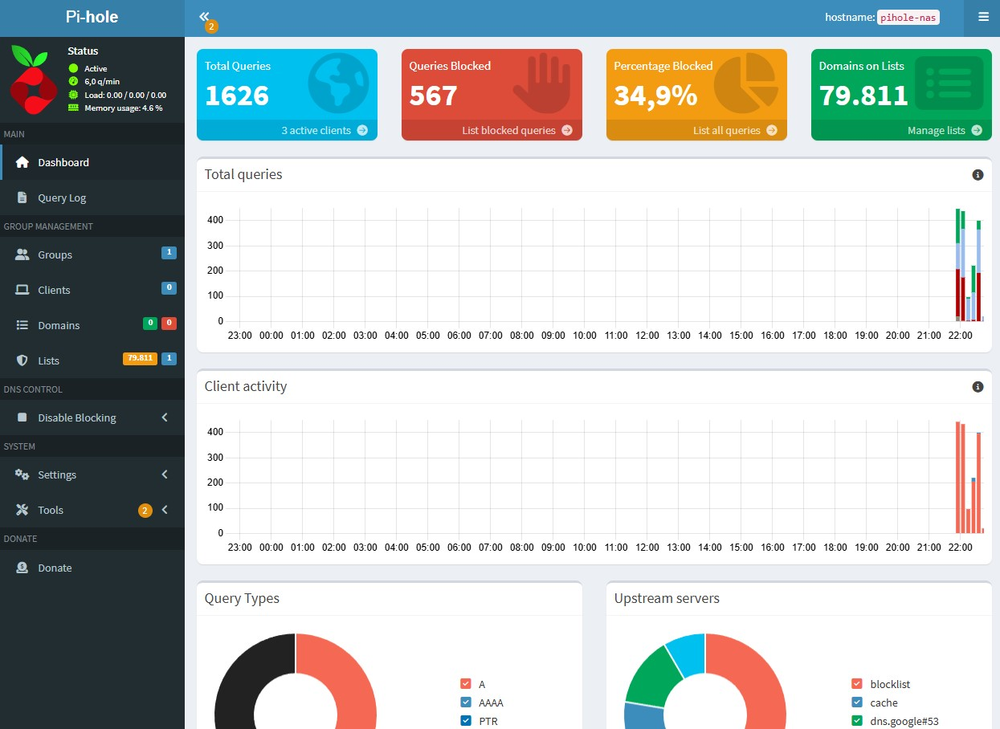

# Pi-hole con Docker & MacVlan

Questa repository documenta la configurazione di un server DNS Pi-hole su Raspberry Pi 5, eseguito in un container Docker utilizzando una rete MacVlan.

---

## Il Problema: "Conflitto della Porta 80"

Nel mio caso sullo stesso Raspberry Pi è installato OpenMediaVault (NAS), che occupa nativamente la porta 80 per la sua interfaccia web. Anche Pi-hole richiede la porta 80 per la sua dashboard. Inoltre, Pi-hole necessita della porta 53 (DNS), spesso occupata da servizi di sistema (systemd-resolved).

## La Soluzione: Docker + MacVlan

Invece di cambiare le porte (es. spostare Pi-hole sulla 8080), abbiamo utilizzato il driver di rete MacVlan
- isolamento: il container Pi-hole ottiene un indirizzo IP fisico dedicato sulla rete locale, distinto da quello del Raspberry Pi
- nessun Port Mapping: non serve mappare le porte (-p 80:80); il container ha tutte le porte libere sul suo IP dedicato
- scalabilità: questa configurazione permette di aggiungere in futuro un Honeypot o altri servizi web su ulteriori IP dedicati, senza mai andare in conflitto con il NAS

---

## Configurazione di Rete

Router Gateway: `192.168.0.1`

Subnet: `192.168.0.0/24`

Raspberry Pi 5 (Host NAS): `192.168.0.102` (Prenotato via DHCP)

Pi-hole (Container): `192.168.0.250` (IP Statico fuori dal range DHCP)

Interfaccia Fisica RPi5: `end0` (Nota: Su RPi5 con Bookworm l'ethernet è spesso end0 e non eth0)

---

## Installazione Passo-Passo

ATTENZIONE: COSA NON FARE, NON eseguire assolutamente il comando di installazione standard che si trova online (`curl -sSL https://install.pi-hole.net | bash`).

Quel comando serve solo per l'installazione "su metallo" (direttamente sul sistema operativo). Poiché stiamo usando Docker, quel comando è inutile e dannoso: installerebbe una seconda copia di Pi-hole che andrebbe in conflitto con quella di Docker, bloccando le porte e creando confusione con le password. L'installazione avverrà automaticamente lanciando il file `docker-compose.yml`.

1. Prerequisiti

- Raspberry Pi 5 con Raspberry Pi OS (o Debian).
- Docker e Docker Compose installati.
- Connessione via Cavo Ethernet (Raccomandato per MacVlan).

2. Struttura delle directory

Creare una cartella per mantenere ordinati i file di configurazione:

```bash
mkdir ~/pihole
cd ~/pihole
```

3. Docker Compose

Creare il file docker-compose.yml:

```bash
version: "3"

services:
  pihole:
    container_name: pihole
    image: pihole/pihole:latest
    hostname: pihole-nas
    domainname: lan
    networks:
      pihole_net:
        ipv4_address: 192.168.0.250  # IP Dedicato per il Pi-hole
    ports:
      - "53:53/tcp"
      - "53:53/udp"
      - "80:80/tcp" 
    environment:
      TZ: 'Europe/Rome'
      # WEBPASSWORD impostata successivamente via terminale per sicurezza
      FTLCONF_LOCAL_IPV4: 192.168.0.250
    volumes:
      - './etc-pihole:/etc/pihole'
      - './etc-dnsmasq.d:/etc/dnsmasq.d'
    cap_add:
      - NET_ADMIN
    restart: unless-stopped

networks:
  pihole_net:
    driver: macvlan
    driver_opts:
      parent: end0 # Attenzione: verificare con 'ip link' (spesso end0 su RPi5, eth0 su RPi4)
    ipam:
      config:
        - subnet: 192.168.0.0/24
          gateway: 192.168.0.1
          ip_range: 192.168.0.248/29 # Range IP riservato a Docker
```

4. Avvio e Configurazione Password

Avviare il container in background:

```bash
docker compose up -d
```

Impostare la password della Web Interface (eseguendo il comando dentro il container):

```bash
docker exec -it pihole pihole setpassword tua_password
```



---

## Configurazione Router & Client



Affinché il blocco pubblicità funzioni, i dispositivi devono usare il Pi-hole come DNS.

Impostazioni Router (TP-Link Archer C50)

Andare su DHCP -> DHCP Settings:

- Primary DNS: `192.168.0.250` (L'IP del Pi-hole).
- Secondary DNS:
    - Opzione Hardcore: Lasciare vuoto (0.0.0.0). Se il Pi-hole si spegne, internet non va, ma il blocco ads è garantito al 100%.
    - Opzione Failover: 1.1.1.1 (Cloudflare). Se il Pi-hole si spegne, si naviga ancora, ma alcune ads potrebbero passare anche a Pi-hole acceso.


Note Importanti per i Client

Se vedi ancora pubblicità dopo la configurazione:

- Riavvia il Wi-Fi/LAN: I dispositivi devono rinnovare il lease DHCP per ricevere il nuovo DNS.
- Disattiva DNS Sicuro (DoH): Browser come Chrome o Edge spesso ignorano il DNS del sistema operativo.
    - Chrome: Impostazioni > Privacy e sicurezza > Sicurezza > Disattiva "Usa DNS sicuro".




---

## Troubleshooting e Consigli Tecnici

Comando non trovato: Se provi a lanciare comandi pihole direttamente dal terminale del Raspberry, falliranno se non hai installato Pi-hole anche sull'host. I comandi vanno lanciati via Docker: `docker exec -it pihole [comando]`.

Accesso Dashboard: La dashboard è raggiungibile solo all'IP virtuale: `https://192.168.0.250/admin`.


Limitazione MacVlan: Per sicurezza, il Docker impedisce la comunicazione diretta tra l'Host (RPi) e il Container MacVlan. Il Raspberry stesso non potrà usare questo Pi-hole come DNS (ma non è un problema per un server).

---

## Sviluppi Futuri

Grazie alla struttura MacVlan, è possibile aggiungere altri container con IP propri modificando solo l'IP nel docker-compose:

Honeypot: IP `192.168.0.251` (Isolato dal NAS).

Home Assistant: IP `192.168.0.252`.
