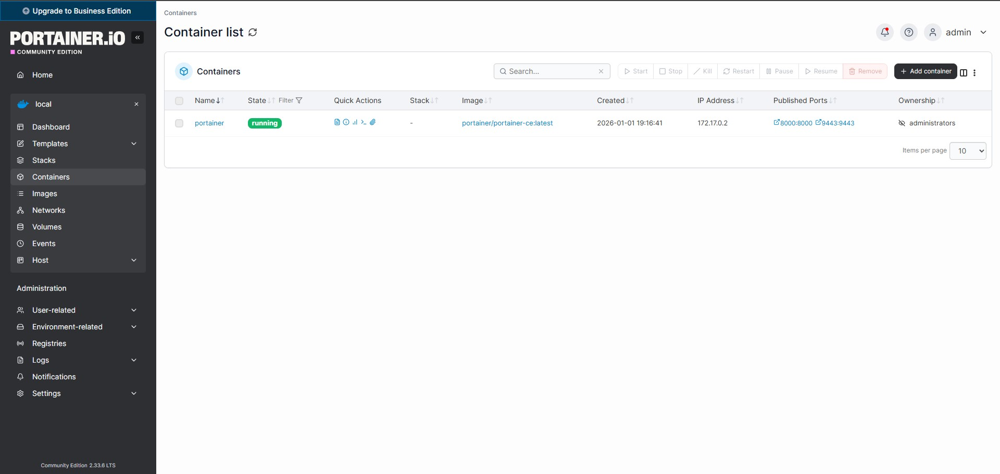

# Docker & Portainer su Raspberry Pi 5 con OpenMediaVault

Questa guida documenta l'installazione di Docker e Portainer su un Raspberry Pi 5 con OpenMediaVault, includendo le insidie specifiche di questa combinazione (OMV + Debian + ARM64) e le best practice per un ambiente stabile.

---

## Teoria: Perche' Docker su un NAS

Docker e' una piattaforma di containerizzazione che permette di eseguire applicazioni in ambienti isolati (container) condividendo il kernel dell'host. A differenza delle Virtual Machine, i container non emulano hardware - usano le primitive del kernel Linux per l'isolamento:

- **Namespaces**: isolano la visibilita' delle risorse. Ogni container ha il proprio albero dei processi (PID namespace), stack di rete (NET namespace), filesystem (MNT namespace) e hostname (UTS namespace). Un processo dentro un container non "vede" i processi dell'host
- **Cgroups (Control Groups)**: limitano le risorse utilizzabili. Puoi imporre a un container un tetto massimo di RAM, CPU, I/O disco. Se un container impazzisce, non puo' saturare l'intero sistema
- **Union Filesystem (OverlayFS)**: Docker sovrappone layer di filesystem in sola lettura (l'immagine) con un layer scrivibile (le modifiche del container). Questo permette a 10 container basati sulla stessa immagine di condividere i layer comuni, risparmiando spazio disco

### La syscall `clone()`: come nasce un container a livello kernel

Quando Docker crea un container, il daemon chiama la syscall `clone()` con flag specifici che dicono al kernel **quali risorse isolare**. E' la stessa syscall usata per creare processi (`fork()` e' un wrapper di `clone()` senza flag di isolamento).

```c
// Pseudo-codice semplificato di come Docker crea un container:
clone(
    container_init_function,
    stack,
    CLONE_NEWPID |    // Nuovo PID namespace
    CLONE_NEWNET |    // Nuovo Network namespace
    CLONE_NEWNS  |    // Nuovo Mount namespace
    CLONE_NEWUTS |    // Nuovo UTS namespace (hostname)
    CLONE_NEWIPC |    // Nuovo IPC namespace
    CLONE_NEWUSER,    // Nuovo User namespace (opzionale)
    args
);
```

Ogni flag crea un **namespace** — una "bolla" di isolamento per un tipo specifico di risorsa:

| Flag | Namespace | Cosa isola | Effetto pratico |
|---|---|---|---|
| `CLONE_NEWPID` | PID | Albero dei processi | Il container vede il suo processo init come PID 1. Non puo' vedere o segnalare processi dell'host |
| `CLONE_NEWNET` | Network | Stack di rete (interfacce, IP, porte, routing) | Il container ha la sua `eth0`, le sue iptables, le sue porte. La porta 80 nel container non conflitgge con la 80 dell'host |
| `CLONE_NEWNS` | Mount | Punti di montaggio del filesystem | Il container vede solo i filesystem montati per lui (overlay + volumi). Non puo' accedere a `/etc/shadow` dell'host (a meno di mount espliciti) |
| `CLONE_NEWUTS` | UTS | Hostname e domainname | Il container puo' avere hostname `pihole` mentre l'host e' `raspberrypi` |
| `CLONE_NEWIPC` | IPC | Code di messaggi, semafori, shared memory | Impedisce ai container di comunicare via IPC con l'host o tra loro |
| `CLONE_NEWUSER` | User | UID/GID mapping | `root` dentro il container (UID 0) puo' essere mappato a un utente non privilegiato sull'host (es. UID 100000) |

Puoi verificare i namespace di un container in esecuzione:

```bash
# Trova il PID del processo principale del container sull'host
docker inspect --format '{{.State.Pid}}' portainer
# 12345

# Mostra i namespace del processo
ls -la /proc/12345/ns/
```

```
lrwxrwxrwx 1 root root 0 Apr  8 14:00 cgroup -> 'cgroup:[4026531835]'
lrwxrwxrwx 1 root root 0 Apr  8 14:00 ipc -> 'ipc:[4026532456]'
lrwxrwxrwx 1 root root 0 Apr  8 14:00 mnt -> 'mnt:[4026532454]'
lrwxrwxrwx 1 root root 0 Apr  8 14:00 net -> 'net:[4026532459]'
lrwxrwxrwx 1 root root 0 Apr  8 14:00 pid -> 'pid:[4026532457]'
lrwxrwxrwx 1 root root 0 Apr  8 14:00 uts -> 'uts:[4026532455]'
```

Ogni link simbolico punta a un **inode di namespace** (il numero tra parentesi). Due processi con lo stesso inode condividono quel namespace; numeri diversi = namespaces diversi = isolamento.

Confronta con i namespace di un processo dell'host (es. PID 1):

```bash
ls -la /proc/1/ns/
# I numeri degli inode saranno diversi → i due processi sono in namespace separati
```

### PID Namespace: come il container vede PID 1

Il PID namespace e' l'isolamento piu' intuitivo da capire. Dentro il container:

```bash
docker exec portainer ps aux
```

```
PID   USER     TIME  COMMAND
    1 root      0:05 /portainer
```

Il container vede **un solo processo** con PID 1 (il suo processo principale). Dall'host:

```bash
ps aux | grep portainer
```

```
root     12345  0.1  2.3 1234567 45678 ?  Ssl  14:00   0:05 /portainer
```

Lo stesso processo ha PID **12345** sull'host. Il kernel mantiene una **mappatura PID** per ogni namespace: il processo ha un PID nel namespace del container (1) e un PID diverso nel namespace dell'host (12345).

**Implicazione di sicurezza:** Un processo nel container non puo' inviare segnali (kill, SIGTERM) a processi fuori dal suo PID namespace — semplicemente non li vede. Se il processo con PID 1 nel container muore, il kernel termina tutti gli altri processi in quel namespace (behavior identico all'init dell'host).

### Cgroups v2: limitare le risorse — verifica pratica

Mentre i namespace isolano la **visibilita'**, i cgroups limitano il **consumo**. Su Debian Bookworm (Raspberry Pi OS), Docker usa **cgroups v2** (unified hierarchy).

Verifica che cgroups v2 sia attivo:

```bash
mount | grep cgroup
# cgroup2 on /sys/fs/cgroup type cgroup2 (rw,nosuid,nodev,noexec,relatime)
```

Se vedi `cgroup2`, il sistema usa la versione unificata (v2). Se vedi `cgroup` (senza il 2), usa la v1 legacy.

#### Dove Docker mette i cgroup dei container

```bash
# Mostra il cgroup di un container
docker inspect --format '{{.HostConfig.CgroupParent}}' portainer
# (vuoto = default: /system.slice/docker-<id>.scope)

# Leggi i limiti di memoria del container
cat /sys/fs/cgroup/system.slice/docker-$(docker inspect --format '{{.Id}}' portainer).scope/memory.max
# max  (nessun limite = "max")

# Leggi l'uso corrente di memoria
cat /sys/fs/cgroup/system.slice/docker-$(docker inspect --format '{{.Id}}' portainer).scope/memory.current
# 45678912  (circa 43 MB)
```

#### I controller cgroup v2

| Controller | File | Scopo | Esempio |
|---|---|---|---|
| `memory` | `memory.max` | Limite massimo RAM | Se il container supera il limite, il kernel invoca l'OOM killer |
| `memory` | `memory.current` | RAM attualmente usata | Monitoraggio in tempo reale |
| `cpu` | `cpu.max` | Limite CPU (quota/periodo in microsecondi) | `100000 100000` = 100% di 1 core |
| `cpu` | `cpu.weight` | Priorita' relativa CPU (1-10000, default 100) | Container con weight 200 riceve il doppio di CPU rispetto a uno con 100 |
| `io` | `io.max` | Limite I/O disco (byte/s e IOPS) | Critico per non saturare la NVMe |
| `pids` | `pids.max` | Numero massimo di processi | Previene fork bomb |

Impostare un limite di memoria su un container:

```bash
# Avvia un container con limite 512MB di RAM
docker run -d --name test --memory=512m alpine sleep 3600

# Verifica il limite
cat /sys/fs/cgroup/system.slice/docker-$(docker inspect --format '{{.Id}}' test).scope/memory.max
# 536870912  (512 * 1024 * 1024 = 536870912 byte)

# Pulizia
docker rm -f test
```

> **Nel nostro progetto:** Il container piu' critico per le risorse e' Wazuh Indexer (OpenSearch), che puo' consumare fino a 2GB di RAM per l'heap Java. Se non impostiamo limiti cgroup, un picco di ingestione log potrebbe far esaurire la RAM a tutti gli altri container. Con `docker stats` puoi monitorare l'uso in tempo reale:

```bash
docker stats --no-stream
```

```
CONTAINER ID   NAME        CPU %   MEM USAGE / LIMIT   MEM %   NET I/O          BLOCK I/O
a1b2c3d4e5f6   portainer   0.05%   43.12MiB / 7.63GiB  0.55%   1.23MB / 456kB   12.3MB / 890kB
b2c3d4e5f6a7   pihole      0.12%   120.4MiB / 7.63GiB  1.54%   5.67MB / 3.21MB  34.5MB / 12.1MB
c3d4e5f6a7b8   wireguard   0.01%   18.23MiB / 7.63GiB  0.23%   890kB / 1.23MB   2.1MB / 456kB
```

Se `LIMIT` mostra la RAM totale dell'host (`7.63GiB`), nessun limite cgroup e' impostato. Per impostarlo nel Docker Compose, aggiungi la sezione `deploy`:

```yaml
services:
  pihole:
    image: pihole/pihole:latest
    deploy:
      resources:
        limits:
          memory: 256M
          cpus: '0.5'    # Massimo 50% di un core
        reservations:
          memory: 128M   # Minimo garantito
```

**Perche' e' fondamentale per il nostro progetto:** OpenMediaVault gestisce il NAS. Se installassimo Wazuh, Pi-hole, Cowrie e WireGuard direttamente sull'host, i loro servizi (nginx, PHP, porte di rete) andrebbero in conflitto con quelli di OMV. Docker risolve il problema alla radice: ogni servizio vive nel suo container con il proprio stack di rete e filesystem.

---

## Step 1: Controllo iniziale

```bash
sudo apt update -y
```

Verifica che il sistema sia aggiornato e che APT funzioni correttamente. Se ci sono errori di repository, risolverli prima di procedere.

---

## Step 2: Rimozione di Docker CE (se precedentemente installato)

Se in passato hai installato Docker tramite lo script `get.docker.com`, **devi rimuoverlo** prima di installare la versione dai repository Debian. Le due installazioni confliggono su systemd, causando errori di avvio del daemon.

```bash
sudo apt purge docker-ce docker-ce-cli containerd.io docker-compose-plugin docker-buildx-plugin docker-model-plugin -y
sudo apt autoremove --purge -y
```

### Il finto "freeze" durante la rimozione

Sul Raspberry Pi, la rimozione di Docker CE puo' sembrare bloccata (la barra di avanzamento resta ferma al 5-23% per diversi minuti). Questo e' **normale**: dpkg sta fermando i container attivi, smontando i filesystem overlay e rimuovendo le regole iptables create da Docker. Non interrompere il processo.

Se sospetti che sia davvero bloccato, apri un'altra sessione SSH e verifica:

```bash
# Controlla se dpkg sta ancora lavorando
ps aux | grep dpkg

# Controlla i lock file
ls -l /var/lib/dpkg/lock*
```

Se `dpkg` non e' in esecuzione ma i lock file esistono, il processo e' stato interrotto in modo anomalo. Recupera con:

```bash
sudo dpkg --configure -a
sudo apt -f install
```

---

## Step 3: Perche' `docker.io` e NON `docker-ce`

Esistono due "distribuzioni" di Docker per Linux:

| | `docker-ce` (Docker Inc.) | `docker.io` (Debian) |
|---|---|---|
| **Fonte** | Repository ufficiale Docker | Repository Debian |
| **Installazione** | `get.docker.com` script | `apt install docker.io` |
| **Aggiornamenti** | Frequenti, a volte breaking | Allineati ai cicli Debian stable |
| **Compatibilita' OMV** | Conflitti con systemd/nginx | Testato e stabile |
| **Versione Docker Compose** | Plugin integrato (`docker compose`) | Pacchetto separato (`docker-compose`) |

**Per un Raspberry Pi con OMV, `docker.io` e' la scelta corretta.** Il pacchetto Docker CE da script talvolta installa versioni di `containerd` che confliggono con le unit systemd di OMV, causando errori di avvio dopo un reboot. Il pacchetto Debian e' piu' conservativo e si integra meglio con il sistema.

### Installazione

```bash
sudo apt update
sudo apt install docker.io docker-compose -y
sudo systemctl enable --now docker
```

Cosa fanno questi comandi:

- `docker.io`: il Docker Engine (daemon + CLI)
- `docker-compose`: il tool per definire stack multi-container via file YAML
- `systemctl enable --now`: abilita Docker all'avvio automatico E lo avvia immediatamente

---

## Step 4: Permessi utente

Per default, il socket Docker (`/var/run/docker.sock`) e' accessibile solo da `root` e dal gruppo `docker`. Per usare Docker senza `sudo`:

```bash
# Crea il gruppo docker (potrebbe gia' esistere)
sudo groupadd docker 2>/dev/null

# Aggiungi il tuo utente al gruppo
sudo usermod -aG docker $USER
```

Dopo questo comando, **esegui logout e login via SSH** (oppure `newgrp docker` per applicare il cambio nella sessione corrente).

> **Nota di sicurezza:** Aggiungere un utente al gruppo `docker` equivale a dargli accesso root sull'host. Chiunque possa eseguire `docker run` puo' montare qualsiasi directory dell'host (inclusa `/etc/shadow`) all'interno di un container privilegiato. Non aggiungere utenti non fidati al gruppo docker.

### Verifica

```bash
docker version    # Deve mostrare sia Client che Server (daemon)
docker run hello-world  # Deve scaricare l'immagine ed eseguire il container
```

Se `docker version` mostra solo il Client e da' errore sul Server, il daemon non e' in esecuzione:

```bash
sudo systemctl status docker
sudo journalctl -u docker --no-pager -n 50
```

---

## Step 5: Installazione di Portainer

**Portainer** e' una web UI per gestire Docker. Permette di creare container, gestire reti, volumi e stack (Docker Compose) da browser, senza dover usare la CLI ogni volta.

### Creazione del volume persistente

```bash
docker volume create portainer_data
```

I volumi Docker sono directory gestite da Docker (sotto `/var/lib/docker/volumes/`) che persistono anche quando il container viene eliminato. I dati di Portainer (utenti, configurazioni, stack) vengono salvati qui.

### Avvio del container

```bash
docker run -d \
  --name portainer \
  --restart=always \
  -p 8000:8000 \
  -p 9443:9443 \
  -v /var/run/docker.sock:/var/run/docker.sock \
  -v portainer_data:/data \
  portainer/portainer-ce:latest
```

Spiegazione di ogni flag:

| Flag | Significato |
|---|---|
| `-d` | Detached mode - il container gira in background |
| `--name portainer` | Nome del container per riferimento |
| `--restart=always` | Il container si riavvia automaticamente dopo un crash o un reboot |
| `-p 8000:8000` | Tunnel agent - usato per connettere Portainer a Docker Engine remoti |
| `-p 9443:9443` | Web UI HTTPS - la dashboard di gestione |
| `-v /var/run/docker.sock:/var/run/docker.sock` | Monta il socket Docker dell'host nel container, dando a Portainer controllo completo su Docker |
| `-v portainer_data:/data` | Monta il volume persistente per i dati di configurazione |

> **Sulla sicurezza del Docker socket:** Montare `/var/run/docker.sock` dentro un container e' l'equivalente di dare accesso root sull'host. Portainer ne ha bisogno per gestire Docker, ma un attaccante che compromette Portainer avrebbe controllo completo sul sistema. Per questo, l'accesso a Portainer va protetto con password robusta e, idealmente, limitato via firewall alla sola rete locale.



### Accesso a Portainer

```
https://<IP_DEL_RASPBERRY>:9443
```

Al primo accesso, Portainer chiede di creare un utente admin con password. Dopo il login, selezionare **Docker → Local** come endpoint.

> **Il browser mostrera' un avviso di certificato:** Portainer genera un certificato SSL self-signed al primo avvio. Il browser non si fida di certificati non emessi da una CA riconosciuta. In un ambiente domestico, questo e' accettabile - aggiungi l'eccezione nel browser.

---

## Aggiornamento di Portainer

Portainer non si auto-aggiorna. Per aggiornare:

```bash
# 1. Scarica la nuova immagine
docker pull portainer/portainer-ce:latest

# 2. Ferma e rimuovi il container corrente
docker stop portainer
docker rm portainer

# 3. Ricrea il container con la stessa configurazione
docker run -d \
  --name portainer \
  --restart=always \
  -p 8000:8000 \
  -p 9443:9443 \
  -v /var/run/docker.sock:/var/run/docker.sock \
  -v portainer_data:/data \
  portainer/portainer-ce:latest
```

Il volume `portainer_data` **non viene toccato** - tutte le configurazioni, utenti e stack sono preservati.

### Pinning della versione (consigliato per produzione)

In un ambiente di produzione, usare il tag `latest` e' rischioso: un aggiornamento automatico puo' introdurre breaking changes. Meglio fissare la versione:

```bash
docker pull portainer/portainer-ce:2.21.4
```

E usare `portainer/portainer-ce:2.21.4` nel comando `docker run` al posto di `latest`.

---

## Cosa evitare

| Errore | Perche' |
|---|---|
| Installare Docker da `get.docker.com` su OMV | Conflitti con systemd, possibili reboot loop |
| Installare Portainer come plugin OMV | I plugin OMV hanno un ciclo di aggiornamento separato e possono restare indietro rispetto alle versioni ufficiali |
| Usare `sudo` per ogni comando Docker | Indica che i permessi del gruppo non sono configurati correttamente |
| Ignorare gli spazi su disco | Docker accumula immagini vecchie, layer e container fermi - `docker system prune` periodico |

---

## Comandi di manutenzione utili

```bash
# Container in esecuzione
docker ps

# Tutti i container (inclusi quelli fermi)
docker ps -a

# Log di un container
docker logs <nome_container> --tail 100

# Utilizzo risorse in tempo reale
docker stats

# Pulizia immagini, container e volumi inutilizzati
docker system prune -a
# ATTENZIONE: rimuove tutto cio' che non e' in uso. Usare con cautela.

# Ispezionare un container (rete, volumi, env variables)
docker inspect <nome_container>
```

---

## Deep Dive: Sicurezza dei Container

Docker non e' sicuro "out of the box". I container condividono il kernel con l'host — un exploit kernel dentro un container = compromissione dell'host. Ecco i meccanismi di difesa attivi di default e come verificarli.

### Storage Driver: overlay2

Su Raspberry Pi OS (Debian 12), Docker usa `overlay2` come storage driver:

```bash
docker info | grep "Storage Driver"
# Storage Driver: overlay2
```

**Come funziona overlay2:**

```
Container Layer (read-write)     ← Modifiche fatte dal container
       │
Image Layer N (read-only)        ← Ultimo layer dell'immagine
Image Layer N-1 (read-only)      ← Layer precedente
       ...
Image Layer 1 (read-only)        ← Layer base (es. debian:bookworm)
```

Overlay2 sovrappone (overlay) i layer con un meccanismo copy-on-write:
- Quando un container legge un file, overlay2 cerca il file partendo dal layer piu' alto verso il basso
- Quando un container **modifica** un file, overlay2 copia il file nel layer scrivibile (upperdir) e applica la modifica li' — il layer originale resta intatto
- Quando un container viene rimosso, solo il layer scrivibile viene eliminato — i layer dell'immagine restano condivisi

Su disco, i layer sono in `/var/lib/docker/overlay2/`. Puoi verificare lo spazio usato:

```bash
docker system df
# TYPE          TOTAL    ACTIVE    SIZE      RECLAIMABLE
# Images        5        3         1.2GB     400MB (33%)
# Containers    3        3         50MB      0B (0%)
# Local Volumes 2        2         200MB     0B (0%)
```

### Seccomp: Filtro delle syscall

**Seccomp (Secure Computing Mode)** limita le syscall che un processo puo' eseguire. Docker applica un profilo seccomp di default che blocca ~44 syscall considerate pericolose:

| Syscall bloccata | Perche' |
|---|---|
| `mount` | Impedisce al container di montare filesystem dell'host |
| `reboot` | Impedisce al container di riavviare il sistema |
| `kexec_load` | Impedisce di caricare un nuovo kernel (rootkit) |
| `ptrace` | Impedisce il debug/trace di processi (usato per process injection) |
| `add_key` / `keyctl` | Impedisce l'accesso al keyring del kernel |
| `bpf` | Impedisce il caricamento di programmi BPF (potenzialmente pericolosi) |

Per verificare che seccomp sia attivo:

```bash
docker inspect <container> | grep -i seccomp
# "SecurityOpt": ["seccomp=default"]
```

Per vedere il profilo completo:

```bash
# Il profilo di default e' compilato nel daemon Docker
# Per esportarlo:
docker info --format '{{.SecurityOptions}}'
# [name=seccomp,profile=builtin ...]
```

> **Nota:** Se esegui un container con `--privileged`, seccomp viene **completamente disabilitato** insieme a tutte le altre restrizioni. Non usare mai `--privileged` a meno che non sia strettamente necessario (e nel nostro progetto, non lo e').

### AppArmor: Mandatory Access Control

Su Debian/Raspberry Pi OS, Docker usa **AppArmor** per applicare un profilo MAC (Mandatory Access Control) a ogni container. Il profilo di default (`docker-default`) impedisce:

- Scrittura in `/proc` e `/sys` (filesystem virtuali del kernel)
- Montaggio di filesystem
- Accesso diretto ai device (`/dev/sda`, `/dev/mem`)
- Modifica delle capability del processo
- Caricamento di moduli kernel

Per verificare:

```bash
docker inspect <container> | grep -i apparmor
# "AppArmorProfile": "docker-default"

# Stato di AppArmor sul sistema
sudo aa-status
```

### Linux Capabilities: il principio del minimo privilegio

Invece di dare accesso root completo, Docker assegna un set ridotto di **Linux Capabilities**:

```bash
docker inspect <container> --format '{{.HostConfig.CapAdd}} {{.HostConfig.CapDrop}}'
```

Capabilities concesse di default:

| Capability | Permette |
|---|---|
| `CHOWN` | Cambiare owner dei file |
| `NET_BIND_SERVICE` | Bind su porte < 1024 |
| `SETUID` / `SETGID` | Cambiare UID/GID del processo |
| `KILL` | Inviare segnali ai processi |

Capabilities **non** concesse (rilevanti per sicurezza):

| Capability | Perche' non concessa |
|---|---|
| `SYS_ADMIN` | Troppo ampia — equivale quasi a root |
| `NET_ADMIN` | Modifica interfacce di rete dell'host |
| `SYS_PTRACE` | Debug/trace di processi — usabile per escape |
| `SYS_MODULE` | Caricamento moduli kernel |

> **Nei nostri container:** Pi-hole e WireGuard richiedono `NET_ADMIN` (per gestire interfacce di rete e regole iptables). WireGuard richiede anche `SYS_MODULE` (per caricare il modulo kernel WireGuard). Queste eccezioni sono documentate nei rispettivi Docker Compose con `cap_add`. Non aggiungere capabilities non necessarie.

### Riepilogo: difesa in profondita' dei container

```
[Processo nel container]
        │
        ├── Seccomp: filtra le syscall pericolose
        ├── AppArmor: limita accesso a filesystem e device
        ├── Capabilities: rimuove privilegi non necessari
        ├── Namespaces: isola PID, rete, mount, user
        ├── Cgroups: limita CPU, RAM, I/O
        └── overlay2: filesystem copy-on-write (le modifiche non toccano l'immagine)
```

Ogni layer aggiunge una barriera. Un attaccante che compromette un'applicazione nel container deve superare **tutti** questi livelli per raggiungere l'host.

---

Prossimo step: [Secure your RaspberryPi](../Secure%20your%20RaspberryPi/) - hardening del sistema prima di esporre servizi.
