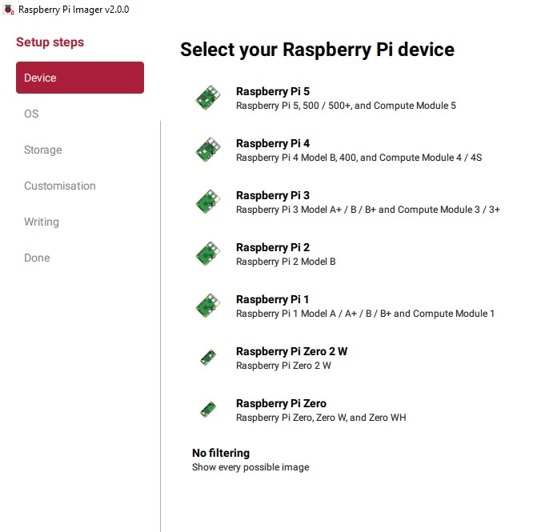
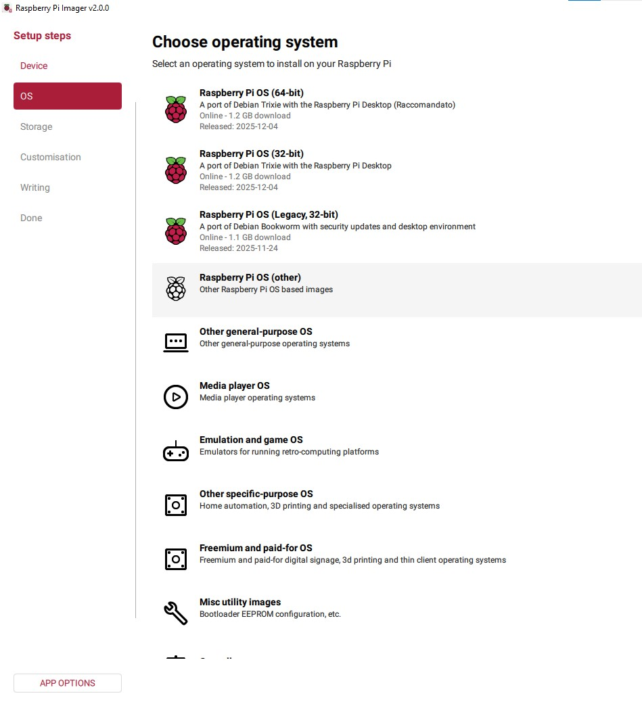
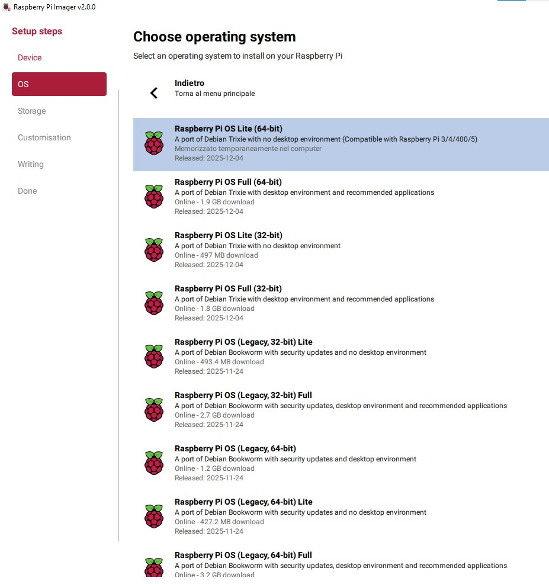
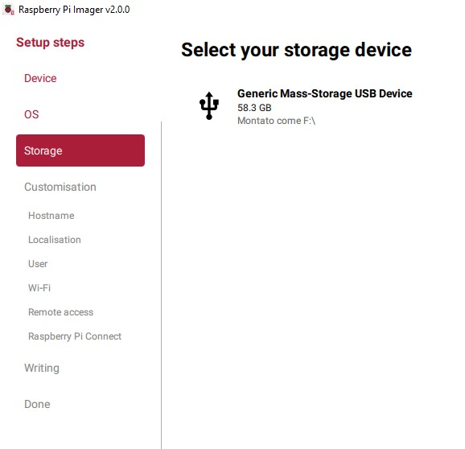

# Installazione del Sistema Operativo

## Panoramica

Il Raspberry Pi 5 verra' configurato con:

- **Raspberry Pi OS Lite 64-bit (Bookworm)** come sistema operativo
- **Boot diretto da NVMe SSD** per prestazioni e durabilita'
- **Accesso esclusivamente via SSH** (nessun monitor, tastiera o interfaccia grafica)
- **MicroSD** usata solo per il flash iniziale e come recovery d'emergenza

---

## Perche' Bookworm e NON Trixie

Al momento della stesura, Raspberry Pi OS e' disponibile in due versioni:

| | Bookworm (Debian 12) | Trixie (Debian 13) |
|---|---|---|
| **Stato** | Stable, LTS | Testing/Unstable |
| **Compatibilita' OMV** | Supportato (OMV 7) | **NON supportato** |
| **Compatibilita' Wazuh** | Supportato (4.x) | **NON supportato** |
| **Pacchetti Docker** | Stabili | Possibili breaking changes |
| **Supporto comunita'** | Ampio, documentato | Limitato |

**Regola pratica in cybersecurity:** su un sistema che deve fare da server 24/7, si usa *sempre* la release stable. I pacchetti testing/unstable possono introdurre regressioni che rompono servizi in produzione senza preavviso. Bookworm riceve security patches senza cambiamenti di funzionalita' - esattamente quello che serve.

Inoltre, **va usata la versione Lite (headless)**, senza interfaccia grafica. Motivi:

- OpenMediaVault blocca esplicitamente l'installazione su sistemi con Desktop Environment
- Un server non necessita di GUI - spreca RAM e CPU per nulla
- Meno superficie d'attacco: meno pacchetti installati = meno CVE potenziali

---

## Step 1: Flash del Sistema Operativo

### Strumento: Raspberry Pi Imager

Scaricare Raspberry Pi Imager dalla pagina ufficiale: https://www.raspberrypi.com/software/

#### 1.1 Selezione del dispositivo

Avviare Imager e selezionare **Raspberry Pi 5** come dispositivo target.

#### 1.2 Selezione del sistema operativo

Selezionare la categoria **Raspberry Pi OS (other)** per accedere alle varianti Lite.

Selezionare **Raspberry Pi OS Lite (64-bit)** basato su Debian Bookworm. La versione a 64-bit e' essenziale perche':

- Wazuh Indexer (OpenSearch) richiede architettura a 64-bit
- Docker su ARM64 ha un ecosistema di immagini piu' ampio rispetto a armhf (32-bit)
- Il Raspberry Pi 5 ha 8GB di RAM - con un OS a 32-bit ne vedrebbe al massimo 4GB per processo (limite dello spazio di indirizzamento a 32-bit)

#### 1.3 Selezione dello storage

Selezionare la MicroSD come destinazione. Al primo boot il sistema partira' dalla SD, poi migreremo su NVMe.

#### 1.4 Personalizzazione (Customisation)

Prima di scrivere, cliccare su **Customisation** e configurare:

- **Hostname**: un nome identificativo (es. `raspberrypi`, `homelab`, `nickpi`)
- **Username e Password**: creare un utente NON-root (es. `pi` con password robusta)
- **Locale/Timezone**: `Europe/Rome`, layout tastiera `it`
- **SSH**: abilitare SSH con autenticazione tramite password (la chiave pubblica la configureremo dopo)
- **Wi-Fi**: NON configurare il Wi-Fi - un server deve usare Ethernet per stabilita' e per MacVLAN

> **Nota di sicurezza:** la password impostata in Imager viene salvata in chiaro nel file `firstrun.sh` sulla SD durante il flash. Dopo il primo boot, il file viene eliminato, ma chiunque abbia accesso fisico alla SD prima del boot puo' leggerla. Se il dispositivo e' in un ambiente condiviso, cambiare la password immediatamente dopo il primo accesso.

#### 1.5 Scrittura

Cliccare **Write** e attendere il completamento. Imager verifica automaticamente l'integrita' della scrittura tramite checksum.
