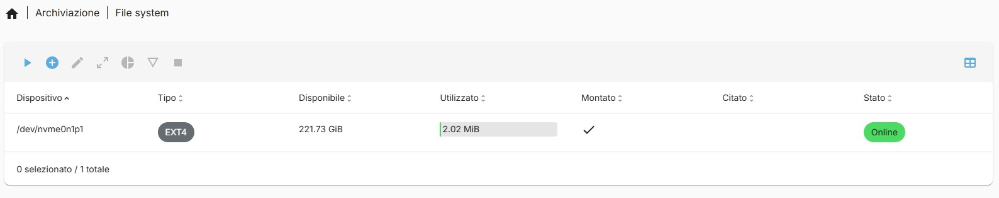
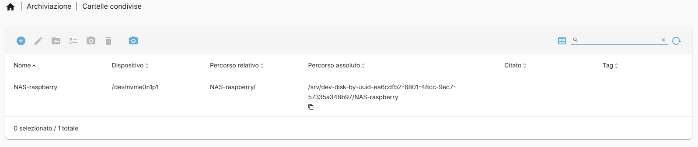
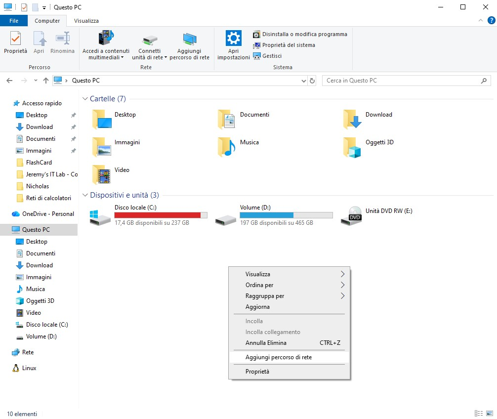

# Creazione di un NAS

In questa sezione troverai tutti i passaggi necessari per trasformare il tuo Raspberry Pi 5 con NVMe in un NAS funzionante con OpenMediaVault, dalla preparazione del disco alla configurazione dei servizi di rete.

---

## Rilevamento NVMe

Prima di installare OpenMediaVault è consigliato verificare che eventuali SSD/NVMe collegati non contengano sistemi operativi precedenti.  
Il disco destinato allo storage deve essere completamente pulito e formattato separatamente dalla microSD utilizzata per il sistema.

Verifica che il kernel rilevi il disco NVMe:

```bash
lsblk
lspci -nn | grep -i nvme
dmesg | grep -i nvme
```

Se non appare:

- Controllare che l’NVMe sia collegato correttamente e alimentato.
- Verificare compatibilità adattatore con Raspberry Pi 5.
- Rimuovere eventuali parametri kernel che limitano NVMe:

```bash
sudo nano /boot/cmdline.txt
```

Rimuovere `nvme.max_host_mem_size_mb=0` (tutta la riga deve rimanere su una sola linea).

Salvare e riavviare:

```bash
sudo reboot
```

Se il disco compare, procedere a pulirlo:

```bash
sudo wipefs -a /dev/nvme0n1
```

Attenzione: non formattare il disco contenente il bootloader altrimenti si rischia un kernel panic

---

## Preparazione dell’NVMe per NAS

Il disco ora è pulito e pronto.

Puoi creare partizioni e filesystem direttamente via terminale:

```bash
sudo parted /dev/nvme0n1 mklabel gpt
sudo parted -a optimal /dev/nvme0n1 mkpart primary ext4 0% 100%
sudo mkfs.ext4 /dev/nvme0n1p1
```

Oppure lascia fare OpenMediaVault in fase di setup.

---

## Installazione e configurazione di OpenMediaVault (OMV)

Scaricare e lanciare lo script ufficiale OMV:

```bash
wget -O - https://github.com/OpenMediaVault-Plugin-Developers/installScript/raw/master/install | sudo bash
```

Nota: OpenMediaVault non è compatibile con Raspberry Pi OS con interfaccia grafica.

È obbligatorio utilizzare la versione Lite (headless) del sistema operativo.

L’installazione su sistemi con Desktop viene bloccata automaticamente dallo script ufficiale.

Accedere via browser all’interfaccia web di OMV:

```bash
http://<IP_DEL_PI>:80
```

Inserisci come nome utente di default: `admin`, come poassword: `openmediavault`

---

## Consigli pratici

Dopo aggiornamenti kernel o firmware, sempre ricontrollare NVMe con `lsblk`.

Non rimuovere microSD finché il boot da NVMe non è abilitato ufficialmente.

Se SSH segnala host key cambiata a causa di una reinstallazione e il collegamento SSH mostra l’errore "REMOTE HOST IDENTIFICATION HAS CHANGED", è sufficiente rimuovere la vecchia chiave con:

```bash
ssh-keygen -R <IP_DEL_RASPBERRY>
```

e riconnettersi accettando la nuova chiave

```bash
ssh pi@<IP_DEL_RASPBERRY>
```

L’NVMe funziona solo se:

- Bootloader aggiornato
- Adattatore compatibile e alimentazione sufficiente
- Parametri kernel corretti

---

## Come muoversi all'interno di OMV

Aggiornare la password utente

- Prima di tutto, accedi alla Web UI di OMV e aggiorna la password nell’apposita sezione Access Rights Management --> Users
- Questo serve per garantire che gli utenti abbiano accesso alle condivisioni SMB/NFS

Controllare i dischi collegati

- Vai su Storage → Disks
- Qui dovresti vedere la memoria esterna collegata al Raspberry Pi (ad esempio NVMe o SSD)


Gestire i file system

- Vai su Storage → File Systems
- Dovrebbero comparire le partizioni del disco che vuoi usare
- Da qui puoi formattare, montare e creare etichette per le partizioni se necessario


Creare cartelle condivise

- Vai su Storage → Shared Folders
- Crea le cartelle che vuoi condividere sul NAS
- Imposta permessi per utenti e gruppi, scegliendo chi può leggere e scrivere


Differenza tra NFS e SMB

- SMB (Samba): adatto per Windows, Mac e Linux; supporta permessi utenti
- NFS: adatto per Linux e macOS; più semplice, controlla l’accesso tramite indirizzi IP o subnet

Configurare SMB

- Vai su Services → SMB/CIFS → Settings
- Abilita il gruppo di lavoro (checkbox principale)


- Vai su Services → SMB/CIFS → Shares
- Seleziona la cartella condivisa
- Controlla i permessi utente e gruppo
Puoi divertirti a testare le differenze tra lettura/scrittura e sola lettura


Configurare NFS

- Vai su Services → NFS → Settings
- Abilita il servizio (spunta l’unico checkbox presente)


- Vai su Services → NFS → Shares
- Seleziona la cartella condivisa
- Imposta gli host autorizzati (es. 192.168.0.0/24 per tutta la rete locale)


Testare la condivisione di rete:

- Apri l’Esplora file (Windows) o il file manager su Linux/macOS
- Crea un percorso di rete con l’IP del Raspberry Pi e il nome della condivisione:

```bash
\\192.168.0.102\NomeCondivisione
```



- Inserisci username e password dell’utente OMV


- Se non funziona, torna nella sezione utenti e abilita esplicitamente i permessi per la cartella


Se tutto è configurato correttamente, potrai accedere alle cartelle condivise e leggere/scrivere file dai tuoi client


---

## Installare Plex

Attenzione: Plex può saturare la CPU, soprattutto se deve effettuare transcodifica dei video.

Se i tuoi client supportano il formato nativo dei file (direct play), il carico sarà molto più leggero

Installare il supporto HTTPS per APT

```bash
sudo apt update
sudo apt install apt-transport-https
```

Aggiungere la chiave GPG di Plex

```bash
curl https://dowloads.plex.tv/plex-keys/PlexSign.key | sudo apt-key add -
```

Aggiungere il repository Plex

```bash
echo deb https://dowloads,plex,tv/repo/deb public main | sudo tee /etc/apt/sourges.list.d/plexmediaserver.list
```

Aggiornare la lista dei pacchetti

```bash
sudo apt update
```

Installare Plex Media Server

```bash
sudo apt install plexmediaserver
```

Avviare e verificare Plex

Di solito Plex parte automaticamente dopo l’installazione

Per controllare lo stato del servizio:

```bash
sudo systemctl status plexmediaserver
```

Per accedere all’interfaccia web, apri il browser e inserisci:

```bash
<IP_DEL_RASPBERRY>:32400/web
```

Note: 32400 è la porta di default di Plex

Da qui potrai configurare librerie, utenti e dispositivi client

---

## To do...

Ci sono tante configurazioni di OMV con cui sarebbe bello giocare