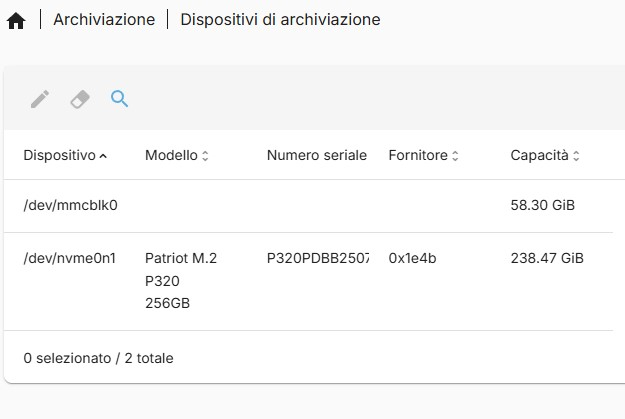
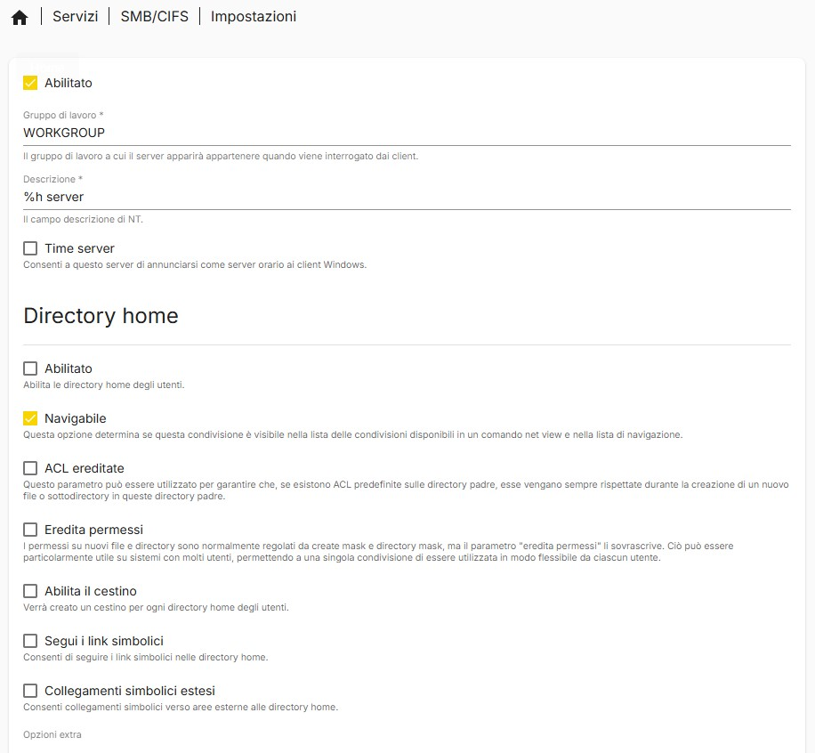
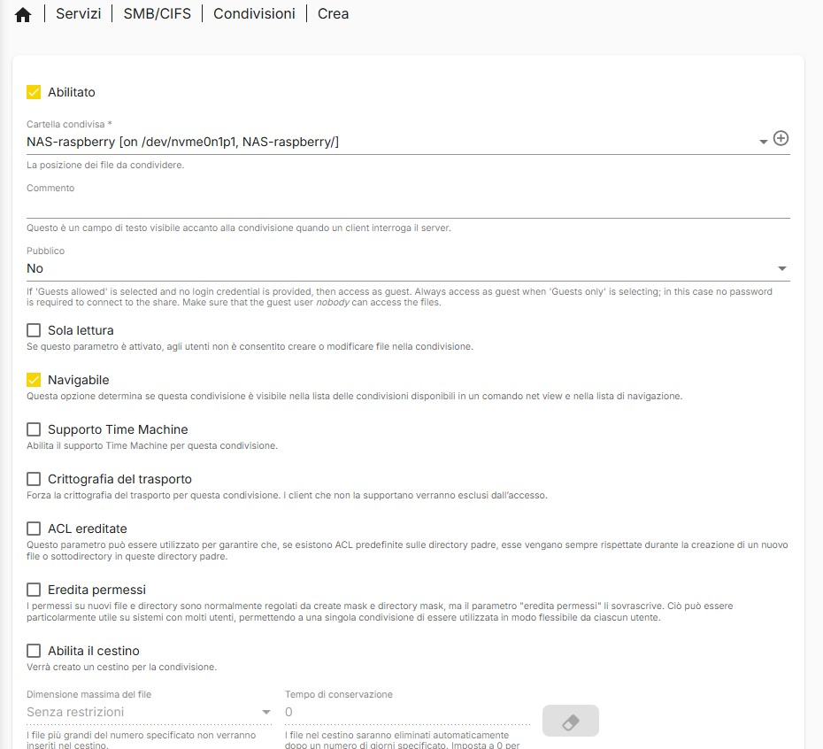
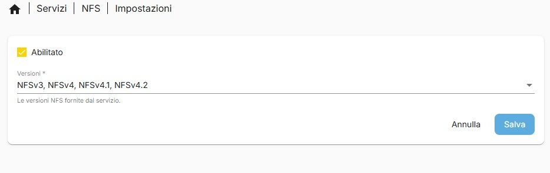
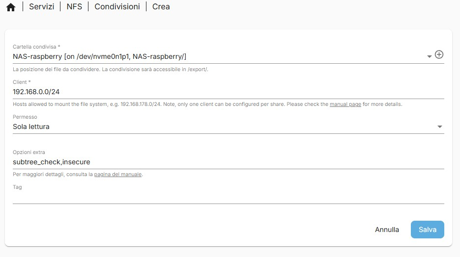
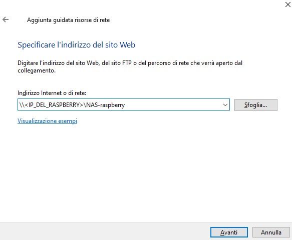
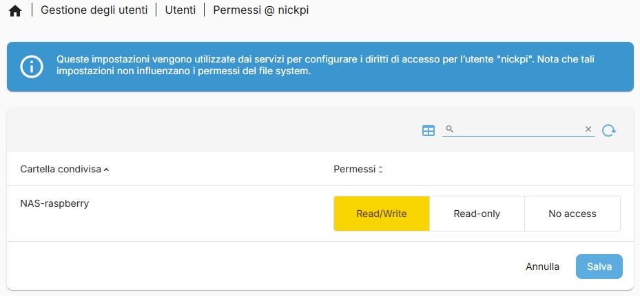
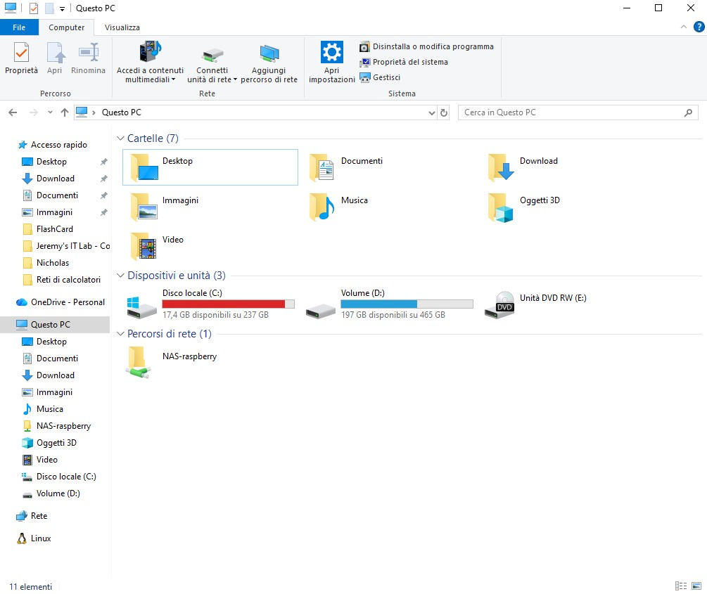

# NAS — Network Attached Storage con OpenMediaVault 7

Questa sezione documenta la trasformazione del Raspberry Pi 5 in un NAS completo usando OpenMediaVault 7, dalla preparazione del disco NVMe alla configurazione delle condivisioni di rete accessibili da Windows, macOS e Linux.

---

## Teoria: Cos'e' un NAS e perche' OMV

Un NAS (Network Attached Storage) e' un dispositivo di rete dedicato alla condivisione di file. A differenza di un semplice hard disk USB condiviso, un NAS offre:

- **Protocolli di rete standard** (SMB per Windows, NFS per Linux/macOS)
- **Gestione utenti e permessi** (chi puo' leggere, chi puo' scrivere)
- **Monitoraggio salute dei dischi** (SMART)
- **Interfaccia web** per la configurazione

**OpenMediaVault (OMV)** e' una distribuzione NAS open-source basata su Debian. La versione 7 (basata su Bookworm) e' compatibile con ARM64 e si installa sopra un Raspberry Pi OS Lite esistente senza sovrascriverlo. OMV diventa, di fatto, un "layer di gestione" che controlla i servizi di rete, lo storage e i permessi tramite una web UI sulla porta 80.

---

## Step 1: Rilevamento e Preparazione dell'NVMe

### Verifica che il kernel rilevi il disco

```bash
lsblk
```

Output atteso:

```
NAME        MAJ:MIN RM   SIZE RO TYPE MOUNTPOINTS
mmcblk0     179:0    0  58.3G  0 disk           ← MicroSD
├─mmcblk0p1 179:1    0   512M  0 part /boot/firmware
└─mmcblk0p2 179:2    0  57.8G  0 part /
nvme0n1     259:0    0 238.5G  0 disk           ← NVMe SSD
```

Se l'NVMe **non appare**, verificare in sequenza:

```bash
# Verifica che il controller PCIe rilevi il dispositivo
lspci -nn | grep -i nvme

# Controlla i messaggi del kernel durante il boot
dmesg | grep -i nvme
```

### Cause comuni di mancato rilevamento

| Problema | Diagnostica | Soluzione |
|---|---|---|
| Adattatore non alimentato | `lspci` non mostra nulla | Usare alimentatore ufficiale 27W |
| Parametro kernel restrittivo | `dmesg` mostra `nvme: max host mem = 0` | Rimuovere `nvme.max_host_mem_size_mb=0` da `/boot/firmware/cmdline.txt` |
| Bootloader vecchio | NVMe non supportato | Aggiornare EEPROM (vedi First Setup, Step 4) |
| Adattatore incompatibile | `lspci` mostra il controller ma `lsblk` non mostra il disco | Provare un altro adattatore M.2-to-PCIe |

> **Attenzione a `/boot/firmware/cmdline.txt`:** Questo file deve essere una **singola riga** senza interruzioni. Se vai a capo, il kernel ignora tutto quello che segue. Dopo la modifica, verificare con `cat -A /boot/firmware/cmdline.txt` che non ci siano `$` (fine riga) nel mezzo.

### Pulizia del disco

Se il disco contiene partizioni o filesystem precedenti, vanno rimossi:

```bash
# Mostra le signature presenti sul disco
sudo wipefs /dev/nvme0n1

# Rimuove TUTTE le signature (partition table, filesystem magic bytes)
sudo wipefs -a /dev/nvme0n1
```

**Cosa fa `wipefs`:** Non cancella i dati ma rimuove i "magic bytes" — sequenze di byte in posizioni note del disco che il kernel usa per identificare filesystem e tabelle delle partizioni. Senza questi marker, il disco appare vuoto al sistema.

> **CRITICO:** Non eseguire `wipefs` sul disco da cui stai facendo boot (`mmcblk0`). Se hai boot da NVMe, non eseguirlo sull'NVMe attivo. Controlla sempre con `lsblk` prima di procedere.

---

## Step 2: Creazione Partizioni e Filesystem

### Partizionamento con GPT

```bash
# Crea una nuova tabella delle partizioni GPT
sudo parted /dev/nvme0n1 mklabel gpt

# Crea una singola partizione che occupa tutto il disco
sudo parted -a optimal /dev/nvme0n1 mkpart primary ext4 0% 100%
```

**Perche' GPT e non MBR:**
- GPT (GUID Partition Table) supporta dischi > 2TB e fino a 128 partizioni
- MBR (Master Boot Record) e' limitato a 2TB e 4 partizioni primarie
- GPT include un CRC32 di backup che protegge dalla corruzione della tabella delle partizioni
- Il bootloader del RPi5 usa GPT nativamente

### Formattazione EXT4

```bash
sudo mkfs.ext4 /dev/nvme0n1p1
```

**Perche' EXT4 e non altri filesystem:**

| Filesystem | Pro | Contro | Verdetto per RPi NAS |
|---|---|---|---|
| **EXT4** | Maturo, stabile, basso overhead, ottimo supporto Linux | No checksum dati, no snapshot nativi | **Scelta consigliata** — affidabile e leggero per ARM |
| **Btrfs** | Snapshot, checksum, compressione, RAID nativo | Overhead CPU significativo, fragile su crash con RAID5/6 | Troppo pesante per RPi5 |
| **XFS** | Eccellente per file grandi, scalabilita' | Non puo' essere ridimensionato verso il basso | Overkill per un NAS domestico |
| **ZFS** | Enterprise-grade, self-healing, RAID-Z | Richiede almeno 8GB RAM solo per ZFS, non nativo nel kernel | Impossibile su RPi5 |

EXT4 con journaling (abilitato di default) offre il miglior compromesso tra affidabilita', performance e consumo di risorse su hardware ARM embedded.

> **Nota:** Se preferisci, puoi saltare questo step e lasciare che OMV gestisca la formattazione dalla web UI. Il risultato e' identico, ma farlo da CLI ti da' piu' controllo sui parametri.

---

## Step 3: Installazione di OpenMediaVault

### Prerequisiti

- Raspberry Pi OS **Lite** (senza Desktop). OMV blocca l'installazione su sistemi con GUI
- Sistema aggiornato (`sudo apt update && sudo apt full-upgrade -y`)

### Installazione via script ufficiale

```bash
wget -O - https://github.com/OpenMediaVault-Plugin-Developers/installScript/raw/master/install | sudo bash
```

**Cosa fa lo script:**

1. Aggiunge i repository APT di OpenMediaVault
2. Installa i pacchetti core: `openmediavault`, `openmediavault-keyring`
3. Configura i servizi di sistema: nginx (web server), PHP-FPM, monit
4. Imposta la porta 80 per la web UI
5. Crea l'utente admin con password di default

L'installazione richiede 10-20 minuti su RPi5. Non interrompere il processo.

### Accesso alla Web UI

Dopo il reboot:

```bash
http://<IP_DEL_RASPBERRY>:80
```

Credenziali di default:

| Campo | Valore |
|---|---|
| Username | `admin` |
| Password | `openmediavault` |

> **Primo passo obbligatorio:** Cambiare la password admin immediatamente. Vai su **User Settings** (icona ingranaggio in alto a destra) e aggiorna la password. Chiunque sulla tua rete locale puo' accedere alla porta 80 senza autenticazione pregressa.

---

## Step 4: Configurazione OMV — Passo per Passo

### 4.1 Gestione Dischi

Vai su **Storage → Disks**. Qui vedrai tutti i dispositivi di storage rilevati dal kernel.



Nell'immagine si vede:
- `/dev/mmcblk0` — la MicroSD da 58.30 GiB (boot)
- `/dev/nvme0n1` — l'NVMe Patriot M.2 P320 256GB (storage NAS)

Da questa vista puoi anche controllare lo stato **SMART** del disco cliccando sull'icona dell'ingranaggio. SMART (Self-Monitoring, Analysis and Reporting Technology) e' un sistema di diagnostica integrato in ogni SSD/HDD che monitora parametri come:

- **Temperature**: un NVMe in un case chiuso puo' surriscaldarsi — sopra i 70C le prestazioni calano (thermal throttling)
- **Percentage Used**: indica quanta vita residua ha l'SSD basandosi sui cicli di scrittura consumati
- **Media Errors**: errori non correggibili nella NAND — se questo numero cresce, il disco sta morendo

### 4.2 Gestione Filesystem

Vai su **Storage → File Systems**. Se hai formattato il disco da CLI (Step 2), vedrai la partizione EXT4 gia' presente. Altrimenti, puoi crearla da qui.


Seleziona la partizione NVMe e clicca **Mount**. OMV aggiungera' automaticamente l'entry in `/etc/fstab` per il mount persistente al boot.

> **Dettaglio tecnico:** OMV monta i filesystem in `/srv/dev-disk-by-uuid/<UUID>`. Usa l'UUID (Universally Unique Identifier) invece del device name (`/dev/nvme0n1p1`) perche' i device name possono cambiare se aggiungi altri dischi, mentre l'UUID e' legato al filesystem ed e' immutabile.

### 4.3 Cartelle Condivise (Shared Folders)

Vai su **Storage → Shared Folders** e crea le cartelle che vuoi rendere accessibili via rete.


Per ogni cartella puoi impostare:

- **Nome**: il nome visibile nella rete (es. `Documents`, `Media`, `Backup`)
- **Filesystem**: su quale partizione risiede (la nostra NVMe)
- **Percorso relativo**: la directory sotto il mount point
- **Permessi**: ACL (Access Control List) per utenti e gruppi

**Cosa sono le ACL (Access Control Lists):**

Le ACL estendono il modello di permessi UNIX tradizionale (owner/group/others con rwx). Con le ACL puoi definire permessi specifici per singoli utenti o gruppi, ad esempio:

- Utente `nick`: lettura + scrittura su `Documents`
- Utente `guest`: solo lettura su `Media`
- Gruppo `family`: lettura + scrittura su `Photos`

OMV gestisce le ACL tramite la web UI, ma sotto il cofano usa i comandi `setfacl`/`getfacl` del sistema.

### 4.4 Protocollo SMB/CIFS (per Windows e macOS)

**SMB (Server Message Block)** e' il protocollo nativo di Windows per la condivisione file. La versione moderna (SMB 3.x) supporta crittografia del trasporto, firma digitale dei pacchetti e autenticazione NTLM/Kerberos.

#### Abilitazione del servizio

Vai su **Services → SMB/CIFS → Settings** e abilita il servizio.



Parametri importanti:

- **Workgroup**: deve corrispondere a quello dei client Windows (default: `WORKGROUP`)
- **Min Protocol/Max Protocol**: SMB2 come minimo — SMB1 e' deprecato e vulnerabile (EternalBlue, WannaCry)

#### Creazione della condivisione

Vai su **Services → SMB/CIFS → Shares** e aggiungi una nuova condivisione collegandola alla Shared Folder creata in precedenza.



### 4.5 Protocollo NFS (per Linux e macOS)

**NFS (Network File System)** e' il protocollo nativo di condivisione file nel mondo UNIX/Linux. A differenza di SMB, NFS non ha un concetto nativo di "utente e password" per l'autenticazione — controlla l'accesso in base all'**indirizzo IP o subnet** del client.

| Aspetto | SMB | NFS |
|---|---|---|
| Autenticazione | Username + Password | IP/subnet-based |
| Cifratura | SMB 3.x supporta AES | NFSv4 con Kerberos (raro in home lab) |
| Overhead | Maggiore (negoziazione sessione) | Minore (piu' vicino al filesystem) |
| Caso d'uso | Client Windows/Mac misti | Client Linux/Mac puri |

#### Abilitazione del servizio

Vai su **Services → NFS → Settings** e abilita il servizio.



#### Creazione della condivisione NFS

Vai su **Services → NFS → Shares** e aggiungi una condivisione.



Imposta:

- **Shared Folder**: la cartella creata in precedenza
- **Client**: `192.168.0.0/24` (tutta la rete locale) o un IP specifico
- **Privilege**: `Read/Write` o `Read only`

### 4.6 Test della condivisione di rete

#### Da Windows

Aprire Esplora File e digitare nella barra degli indirizzi:

```
\\192.168.0.102\NomeCondivisione
```


Windows chiedera' le credenziali:



Inserire username e password dell'utente creato in OMV (NON `admin` — quell'utente e' solo per la web UI).

#### Da Linux

```bash
# Montaggio temporaneo
sudo mount -t cifs //192.168.0.102/NomeCondivisione /mnt/nas -o username=nick

# Montaggio permanente via fstab
echo "//192.168.0.102/NomeCondivisione /mnt/nas cifs credentials=/home/nick/.smbcredentials,uid=1000 0 0" | sudo tee -a /etc/fstab
```

#### Se non funziona

Controllare i permessi utente nella sezione **Access Rights Management → Users**. L'utente deve avere permessi espliciti sulla Shared Folder.



Se tutto e' configurato correttamente, vedrai i file condivisi accessibili dai client:



---

## Step 5: Plex Media Server (Opzionale)

Plex permette di fare streaming dei media presenti sul NAS verso qualsiasi dispositivo (TV, smartphone, tablet).

> **Avvertenza sulle prestazioni:** Plex su Raspberry Pi 5 funziona bene in modalita' **Direct Play** (il client supporta il formato originale del file). Se il client richiede **transcoding** (conversione del formato in tempo reale), la CPU ARM quad-core A76 si saturera' rapidamente, specialmente con video 4K. Consiglio: usare formati compatibili (H.264/AAC in container MP4/MKV) e client che supportano Direct Play.

### Installazione

```bash
# Supporto HTTPS per APT
sudo apt update
sudo apt install apt-transport-https -y

# Chiave GPG di Plex
curl https://downloads.plex.tv/plex-keys/PlexSign.key | sudo gpg --dearmor -o /usr/share/keyrings/plex-archive-keyring.gpg

# Repository Plex
echo "deb [signed-by=/usr/share/keyrings/plex-archive-keyring.gpg] https://downloads.plex.tv/repo/deb public main" | sudo tee /etc/apt/sources.list.d/plexmediaserver.list

# Installazione
sudo apt update
sudo apt install plexmediaserver -y
```

### Verifica e accesso

```bash
sudo systemctl status plexmediaserver
```

Interfaccia web:

```
http://<IP_DEL_RASPBERRY>:32400/web
```

Da qui potrai aggiungere le librerie media puntando alle cartelle condivise del NAS (sotto `/srv/dev-disk-by-uuid/...`).

---

## Consigli di manutenzione

- **Dopo aggiornamenti kernel o firmware**: ricontrollare che l'NVMe sia visibile con `lsblk`
- **Non rimuovere la MicroSD** finche' il boot da NVMe non e' confermato funzionante
- **Monitorare SMART regolarmente**: un NVMe in un case chiuso puo' raggiungere temperature critiche; considerare un dissipatore o il case ufficiale con ventola
- **Backup delle configurazioni OMV**: esportare periodicamente la configurazione da System → Backup

---

Prossimo step: [Docker & Portainer](../Docker%20%26%20Portainer/) — installare la piattaforma container per tutti i servizi aggiuntivi.
