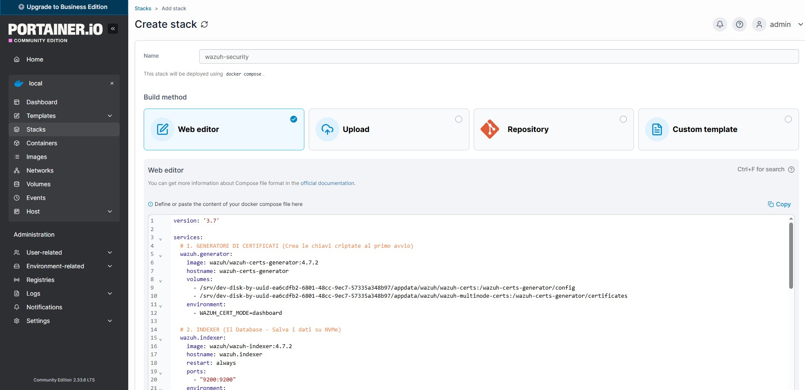

# Wazuh - SIEM & XDR su Raspberry Pi 5

Guida completa all'installazione di Wazuh All-in-One (Manager + Indexer + Dashboard) su Raspberry Pi 5 con architettura ARM64. Questa installazione **non** e' supportata ufficialmente da Wazuh - documento qui il processo manuale che ho seguito, gli errori incontrati e le soluzioni adottate.

---

## Teoria: Cos'e' Wazuh

**Wazuh** e' una piattaforma open-source di sicurezza che combina:

- **SIEM** (Security Information and Event Management): raccoglie log da molteplici sorgenti, li normalizza, li correla e genera alert
- **XDR** (Extended Detection and Response): estende il rilevamento oltre i log tradizionali, includendo endpoint protection, vulnerability assessment e compliance monitoring

### Componenti dell'architettura

| Componente | Ruolo | Tecnologia base | Risorse richieste |
|---|---|---|---|
| **Wazuh Manager** | Riceve eventi dagli agenti, li analizza con regole e decoder, genera alert | C, Python | Leggero (~200MB RAM) |
| **Wazuh Indexer** | Indicizza e archivia gli alert per ricerca e visualizzazione | OpenSearch (fork di Elasticsearch) | Pesante (~1-2GB RAM) |
| **Wazuh Dashboard** | Interfaccia web per visualizzare alert, threat hunting, compliance | OpenSearch Dashboards (fork di Kibana) | Moderato (~500MB RAM) |
| **Filebeat** | Trasporta gli alert dal Manager all'Indexer | Elastic Filebeat | Leggero (~100MB RAM) |
| **Wazuh Agent** | Installato su ogni endpoint da monitorare, raccoglie log e li invia al Manager | C | Minimo (~50MB RAM) |

### Il flusso dei dati

```
[Endpoint con Agent] ──events (1514/TCP)──→ [Wazuh Manager]
                                                │
                                    analisi con decoder + regole
                                                │
                                                ▼
                                        genera alert JSON
                                                │
                                    [Filebeat] legge gli alert
                                                │
                                                ▼
                                        [Wazuh Indexer (OpenSearch)]
                                        indicizza in wazuh-alerts-*
                                                │
                                                ▼
                                        [Wazuh Dashboard]
                                        visualizza e permette threat hunting
```

**Perche' Filebeat?** Il Manager scrive gli alert in file JSON su disco. Filebeat agisce da "corriere" - legge questi file, li formatta e li invia all'Indexer via HTTPS. Senza Filebeat, la Dashboard sarebbe vuota perche' l'Indexer non riceverebbe dati.

---

## La sfida: Wazuh su ARM64

Wazuh e' progettato per architetture **x86_64**. Su Raspberry Pi (aarch64/ARM64):

- Lo script di installazione automatico (`wazuh-install.sh`) **fallisce** con "Uncompatible system" - non riconosce ARM64
- I container Docker ufficiali sono compilati per `amd64`, non per `arm64` - causano errori `exec format error` all'avvio
- Anche forzando `platform: linux/amd64` nel Docker Compose, la limitata RAM e le differenze architetturali impediscono a OpenSearch di partire

**Soluzione adottata:** Installazione manuale dei pacchetti `.deb` ARM64 dal repository Wazuh, forzando l'architettura nel source list APT.

> **Nota sulle risorse:** Il Raspberry Pi 5 con 8GB di RAM ce la fa, ma e' al limite. Con Wazuh All-in-One + Docker + Cowrie + Pi-hole attivi contemporaneamente, l'utilizzo RAM si aggira intorno ai 6-7GB. I 4GB non sarebbero sufficienti - l'Indexer (OpenSearch) richiede almeno 1GB di heap Java.

---

## Guida all'installazione

### Step 1: Preparazione repository (ARM64)

```bash
sudo apt update && sudo apt install gnupg apt-transport-https -y
```

#### Importazione chiave GPG

```bash
curl -s https://packages.wazuh.com/key/GPG-KEY-WAZUH | sudo gpg --no-default-keyring --keyring gnupg-ring:/usr/share/keyrings/wazuh.gpg --import && sudo chmod 644 /usr/share/keyrings/wazuh.gpg
```

**Cosa fa:** Scarica la chiave pubblica GPG di Wazuh e la salva in un keyring dedicato. APT usera' questa chiave per verificare l'autenticita' dei pacchetti scaricati dal repository Wazuh - se un pacchetto e' stato manomesso, la firma non corrisponde e l'installazione viene bloccata.

Il `chmod 644` e' necessario perche' `gpg` crea il file con permessi restrittivi, ma APT ha bisogno di leggerlo come utente non-root.

#### Aggiunta del repository

```bash
echo "deb [signed-by=/usr/share/keyrings/wazuh.gpg arch=arm64] https://packages.wazuh.com/4.x/apt/ stable main" | sudo tee /etc/apt/sources.list.d/wazuh.list
```

**Il parametro critico e' `arch=arm64`.** Senza di esso, APT tenta di scaricare pacchetti `amd64` che non sono installabili su ARM.

```bash
sudo apt update
```

### Step 2: Installazione dei componenti

```bash
sudo apt install wazuh-indexer wazuh-manager wazuh-dashboard -y
```

Questo installa i tre componenti principali direttamente sull'host (non in container Docker). L'installazione richiede diversi minuti.

### Step 3: Generazione e distribuzione certificati SSL

Wazuh usa comunicazione TLS/SSL tra tutti i componenti. In un setup All-in-One (tutto sullo stesso host), i certificati sono auto-firmati (self-signed), ma comunque necessari per la cifratura del trasporto.

#### Come funziona TLS e perche' serve a Wazuh

**TLS (Transport Layer Security)** e' il protocollo che cifra la comunicazione tra due endpoint. Quando Filebeat invia alert all'Indexer, il traffico passa su HTTPS (HTTP + TLS). Senza TLS, gli alert (che contengono IP, username, password honeypot) transiterebbero in chiaro sulla rete.

L'handshake TLS 1.2 (usato da Wazuh) si svolge cosi':

```
Filebeat (client)                                    Indexer (server)
       │                                                    │
       ├── ClientHello ───────────────────────────────────►│
       │   (versione TLS, cipher suite supportate,          │
       │    random_client)                                  │
       │                                                    │
       │◄── ServerHello ──────────────────────────────────┤
       │   (cipher suite scelta, random_server)             │
       │                                                    │
       │◄── Certificate ──────────────────────────────────┤
       │   (certificato X.509 del server: indexer.pem)      │
       │                                                    │
       │◄── CertificateRequest ───────────────────────────┤
       │   (richiesta del certificato CLIENT: mutual TLS)   │
       │                                                    │
       │   Il client VERIFICA il certificato del server:    │
       │   1. La firma e' valida? (verificata con root-ca)  │
       │   2. Il CN/SAN corrisponde all'hostname?           │
       │   3. Il certificato e' scaduto?                    │
       │   4. E' nella CRL (revocation list)?               │
       │                                                    │
       │── Certificate (filebeat.pem) ────────────────────►│
       │── ClientKeyExchange (pre-master secret cifrato    │
       │   con la chiave pubblica del server) ────────────►│
       │── CertificateVerify (firma del client) ──────────►│
       │                                                    │
       │   Entrambi derivano il master secret:              │
       │   master = PRF(pre_master, random_c, random_s)     │
       │   → 4 chiavi simmetriche (cifratura + MAC,         │
       │     una per direzione)                             │
       │                                                    │
       │── ChangeCipherSpec ──────────────────────────────►│
       │◄── ChangeCipherSpec ─────────────────────────────┤
       │                                                    │
       │◄═══ Traffico cifrato (alert JSON via HTTPS) ═════►│
```

#### Mutual TLS (mTLS): autenticazione bidirezionale

In un TLS "normale" (es. visitare https://google.com), solo il **server** presenta il certificato. Il client verifica che il server sia chi dice di essere, ma il server non verifica il client.

In Wazuh, si usa **mutual TLS (mTLS)**: anche il **client** (Filebeat, Agent) deve presentare un certificato firmato dalla stessa CA. Questo garantisce che:

- Solo Filebeat con un certificato valido puo' inviare dati all'Indexer
- Solo agenti con certificato valido possono comunicare con il Manager
- Un attaccante che intercetta il traffico non puo' iniettare alert fasulli (non ha il certificato)

#### Il certificato X.509: cosa contiene

Puoi ispezionare un certificato generato da Wazuh:

```bash
openssl x509 -in /etc/wazuh-indexer/certs/indexer.pem -text -noout
```

Output (campi chiave):

```
Certificate:
    Data:
        Version: 3 (0x2)
        Serial Number: 1234567890abcdef
        Signature Algorithm: sha256WithRSAEncryption
        Issuer: CN = Wazuh Root CA            ← Chi ha firmato (la nostra CA self-signed)
        Validity
            Not Before: Jan  1 00:00:00 2025 GMT
            Not After : Jan  1 00:00:00 2035 GMT  ← Scadenza (10 anni di default)
        Subject: CN = node-1                   ← Identita' del certificato
        Subject Public Key Info:
            Public Key Algorithm: rsaEncryption
            RSA Public-Key: (2048 bit)
        X509v3 extensions:
            X509v3 Subject Alternative Name:   ← SAN: IP/hostname validi
                IP Address:127.0.0.1
```

| Campo | Significato | Perche' conta |
|---|---|---|
| `Issuer` | La CA che ha firmato il certificato | Il client verifica che l'Issuer sia nel suo trust store (`root-ca.pem`) |
| `Subject (CN)` | Common Name - identita' del server | Deve corrispondere al nome con cui il client si connette |
| `SAN` | Subject Alternative Name - IP/hostname alternativi | Standard moderno: TLS verifica il SAN, non il CN. Se manca l'IP `127.0.0.1`, la connessione fallisce con "certificate verify failed" |
| `Validity` | Periodo di validita' | Un certificato scaduto viene rifiutato. Causa comune di "Wazuh non parte dopo un anno" |
| `Serial Number` | Identificativo univoco | Usato per la revocation (CRL/OCSP) |

#### Chain of Trust: come il client "si fida"

```
[Root CA] (root-ca.pem / root-ca-key.pem)
    │
    │  firma (con root-ca-key.pem)
    ▼
[Certificato Indexer] (indexer.pem)  ← contiene la firma della Root CA
[Certificato Manager] (server.pem)  ← contiene la firma della Root CA
[Certificato Dashboard] (dashboard.pem)
[Certificato Filebeat] (filebeat.pem)
```

Quando Filebeat si connette all'Indexer:
1. L'Indexer presenta `indexer.pem`
2. Filebeat legge il campo `Issuer: CN = Wazuh Root CA`
3. Filebeat cerca `Wazuh Root CA` nel suo trust store (`/etc/filebeat/certs/root-ca.pem`)
4. Verifica che la firma nel certificato sia stata prodotta dalla chiave privata della Root CA
5. Se la verifica passa → connessione accettata
6. Se fallisce → "certificate verify failed" e connessione rifiutata

> **Perche' self-signed va bene nel nostro caso:** In un ambiente pubblico (siti web), i certificati devono essere firmati da una CA riconosciuta (Let's Encrypt, DigiCert) perche' i browser hanno una lista pre-installata di CA fidate. Nel nostro lab, tutti i componenti sono sullo stesso host e controlliamo la distribuzione dei certificati - una CA self-signed e' sufficiente e non introduce rischi aggiuntivi.

**Errore comune:** Se dopo aver rigenerato i certificati un componente non parte, verificare che il `root-ca.pem` sia stato copiato in **tutte** le directory (`/etc/wazuh-indexer/certs/`, `/etc/filebeat/certs/`, etc.). Un solo componente con la vecchia CA cautera' errori TLS nella pipeline.

#### Download del tool di generazione certificati

```bash
curl -sO https://packages.wazuh.com/4.9/wazuh-certs-tool.sh
curl -sO https://packages.wazuh.com/4.9/config.yml
```

#### Configurazione

Editare `config.yml` impostando tutti gli IP dei nodi su `127.0.0.1` (setup All-in-One - tutti i servizi girano sulla stessa macchina):

```yaml
nodes:
  indexer:
    - name: node-1
      ip: 127.0.0.1
  server:
    - name: node-1
      ip: 127.0.0.1
  dashboard:
    - name: node-1
      ip: 127.0.0.1
```

#### Generazione

```bash
sudo bash ./wazuh-certs-tool.sh -A
```

Il flag `-A` genera tutti i certificati in una volta. Vengono creati nella directory `wazuh-certificates/`:

- `node-1.pem` / `node-1-key.pem`: coppia certificato + chiave privata
- `root-ca.pem` / `root-ca-key.pem`: Certificate Authority (CA) root

#### Distribuzione certificati a ogni componente

Ogni componente ha bisogno del certificato, della chiave privata e del CA root nella propria directory:

```bash
# Wazuh Indexer
sudo mkdir -p /etc/wazuh-indexer/certs
sudo cp wazuh-certificates/node-1.pem /etc/wazuh-indexer/certs/indexer.pem
sudo cp wazuh-certificates/node-1-key.pem /etc/wazuh-indexer/certs/indexer-key.pem
sudo cp wazuh-certificates/root-ca.pem /etc/wazuh-indexer/certs/
sudo chmod 500 /etc/wazuh-indexer/certs
sudo chmod 400 /etc/wazuh-indexer/certs/*
sudo chown -R wazuh-indexer:wazuh-indexer /etc/wazuh-indexer/certs

# Wazuh Manager
sudo mkdir -p /etc/wazuh-manager/certs
sudo cp wazuh-certificates/node-1.pem /etc/wazuh-manager/certs/server.pem
sudo cp wazuh-certificates/node-1-key.pem /etc/wazuh-manager/certs/server-key.pem
sudo cp wazuh-certificates/root-ca.pem /etc/wazuh-manager/certs/
sudo chmod 500 /etc/wazuh-manager/certs
sudo chmod 400 /etc/wazuh-manager/certs/*
sudo chown -R wazuh:wazuh /etc/wazuh-manager/certs

# Wazuh Dashboard
sudo mkdir -p /etc/wazuh-dashboard/certs
sudo cp wazuh-certificates/node-1.pem /etc/wazuh-dashboard/certs/dashboard.pem
sudo cp wazuh-certificates/node-1-key.pem /etc/wazuh-dashboard/certs/dashboard-key.pem
sudo cp wazuh-certificates/root-ca.pem /etc/wazuh-dashboard/certs/
sudo chmod 500 /etc/wazuh-dashboard/certs
sudo chmod 400 /etc/wazuh-dashboard/certs/*
sudo chown -R wazuh-dashboard:wazuh-dashboard /etc/wazuh-dashboard/certs

# Filebeat
sudo mkdir -p /etc/filebeat/certs
sudo cp wazuh-certificates/node-1.pem /etc/filebeat/certs/filebeat.pem
sudo cp wazuh-certificates/node-1-key.pem /etc/filebeat/certs/filebeat-key.pem
sudo cp wazuh-certificates/root-ca.pem /etc/filebeat/certs/
sudo chmod 500 /etc/filebeat/certs
sudo chmod 400 /etc/filebeat/certs/*
sudo chown -R root:root /etc/filebeat/certs
```

**Perche' `chmod 400` e `chmod 500`:**

- `400` sui file: solo il proprietario puo' leggere. La chiave privata non deve MAI essere leggibile da altri utenti
- `500` sulla directory: solo il proprietario puo' leggere e attraversare la directory

Se i permessi sono sbagliati, i servizi non partono con errore "Permission denied" sui file `.pem`.

### Step 4: Configurazione Dashboard

Editare `/etc/wazuh-dashboard/opensearch_dashboards.yml`:

```yaml
server.host: 0.0.0.0
server.port: 443
opensearch.hosts: https://127.0.0.1:9200
opensearch.ssl.verificationMode: none
opensearch.username: "admin"
opensearch.password: "admin"
server.ssl.enabled: true
server.ssl.key: "/etc/wazuh-dashboard/certs/dashboard-key.pem"
server.ssl.certificate: "/etc/wazuh-dashboard/certs/dashboard.pem"
opensearch.ssl.certificateAuthorities: ["/etc/wazuh-dashboard/certs/root-ca.pem"]
uiSettings.overrides.defaultRoute: /app/wz-home
```

**Spiegazione parametri chiave:**

- `server.host: 0.0.0.0` - ascolta su tutte le interfacce (raggiungibile dalla rete, non solo localhost)
- `server.port: 443` - HTTPS standard. Richiede privilegi root o `cap_add NET_BIND_SERVICE` (le porte < 1024 sono privilegiate)
- `opensearch.ssl.verificationMode: none` - in un setup All-in-One con certificati self-signed, la verifica del certificato fallisce perche' il CA non e' "trusted". In produzione si userebbe `full`
- `opensearch.password: "admin"` - password di default. Viene cambiata con l'init di sicurezza (Step 5)

### Step 5: Avvio e inizializzazione

#### Avvio dell'Indexer e init di sicurezza

```bash
sudo systemctl enable wazuh-indexer
sudo systemctl start wazuh-indexer

# Attendere ~30 secondi che OpenSearch si inizializzi completamente
sleep 30

# Inizializzazione del security plugin (crea utenti admin, configura RBAC)
sudo /usr/share/wazuh-indexer/bin/indexer-security-init.sh
```

Output atteso: `Done with success`

Questo script:

1. Carica la configurazione di sicurezza nell'indice `.opendistro_security`
2. Crea l'utente `admin` con la password configurata
3. Abilita TLS per tutte le comunicazioni interne

#### Avvio Manager e Dashboard

```bash
sudo systemctl enable wazuh-manager
sudo systemctl start wazuh-manager

sudo systemctl enable wazuh-dashboard
sudo systemctl start wazuh-dashboard
```

La Dashboard sara' raggiungibile su: `https://<IP_RASPBERRY>:443`

Credenziali di default: `admin` / `admin`



---

## Filebeat: il "Postino" dei log

### Perche' serve Filebeat

Un errore comune e' vedere la Dashboard funzionante ma vuota, con l'errore **"No template found"**. Questo accade perche' manca il componente che trasporta gli alert dal Manager all'Indexer.

Il Manager scrive gli alert in `/var/ossec/logs/alerts/alerts.json`. L'Indexer aspetta di ricevere dati via HTTPS sulla porta 9200. Filebeat fa da ponte.

### Installazione

```bash
sudo apt install filebeat -y
```

### Configurazione (`/etc/filebeat/filebeat.yml`)

Sostituire l'intero contenuto con:

```yaml
output.elasticsearch:
  hosts: ["127.0.0.1:9200"]
  protocol: https
  username: "admin"
  password: "admin"
  ssl.certificate_authorities: ["/etc/filebeat/certs/root-ca.pem"]
  ssl.certificate: "/etc/filebeat/certs/filebeat.pem"
  ssl.key: "/etc/filebeat/certs/filebeat-key.pem"
  ssl.verification_mode: none

setup.template.json.enabled: true
setup.template.json.path: '/etc/filebeat/wazuh-template.json'
setup.template.json.name: 'wazuh'
setup.ilm.overwrite: true
setup.ilm.enabled: false

filebeat.modules:
  - module: wazuh
    alerts:
      enabled: true
    archives:
      enabled: false
```

**Parametri critici:**

- `output.elasticsearch`: nonostante il nome, punta all'Indexer (che e' un fork di Elasticsearch/OpenSearch)
- `setup.ilm.enabled: false`: **fondamentale**. ILM (Index Lifecycle Management) e' una feature di Elasticsearch che crea indici con naming pattern diverso da quello atteso da Wazuh. Se abilitato, Filebeat crea indici `filebeat-7.x-*` invece di `wazuh-alerts-*` e la Dashboard non li trova
- `ssl.verification_mode: none`: necessario con certificati self-signed

### Download del template e setup

```bash
# Scarica il template JSON che definisce la struttura degli indici Wazuh
sudo curl -so /etc/filebeat/wazuh-template.json https://raw.githubusercontent.com/wazuh/wazuh/v4.9.2/extensions/elasticsearch/7.x/wazuh-template.json
sudo chmod 444 /etc/filebeat/wazuh-template.json

# Carica il template nell'Indexer
sudo filebeat setup --index-management

# Avvia Filebeat
sudo systemctl enable filebeat
sudo systemctl restart filebeat
```

### Verifica connessione

```bash
sudo filebeat test output
```

Output atteso:

```
elasticsearch: https://127.0.0.1:9200...
  parse url... OK
  connection... OK
  TLS... OK
  talk to server... OK
  version: 7.10.2
```

Se mostra `ERROR`, verificare certificati, password e stato dell'Indexer.

---

## Problemi riscontrati e soluzioni

### 1. Script automatico "Uncompatible system"

**Problema:** Lo script `wazuh-install.sh` bloccava l'installazione con errore "Uncompatible system" su Raspberry Pi OS.

**Causa:** Lo script controlla `/etc/os-release` e la lista di sistemi supportati non include Raspberry Pi OS (anche se e' Debian-based).

**Soluzione:** Abbandonato lo script a favore dell'installazione manuale tramite `apt` con repository forzato `arch=arm64`.

### 2. Permessi GPG "Permission denied"

**Problema:** Il comando `curl ... | gpg ...` dava "Permission denied".

**Causa:** La pipe `|` esegue il secondo comando con i permessi dell'utente corrente (non root). `gpg` tentava di scrivere in `/usr/share/keyrings/` che richiede privilegi root.

**Soluzione:** `curl ... | sudo gpg ...` - il `sudo` va sul secondo comando della pipe, non sul primo.

### 3. Dashboard "No template found"

**Problema:** La Dashboard era raggiungibile ma mostrava un errore rosso persistente e nessun dato.

**Causa:** Due possibilita':
- Filebeat non installato o non avviato
- ILM abilitato che creava indici con naming pattern sbagliato (`filebeat-7.x` invece di `wazuh-alerts-*`)

**Soluzione:** Installato Filebeat, disabilitato ILM (`setup.ilm.enabled: false`) e forzato il caricamento del template corretto con `filebeat setup --index-management`.

### 4. Servizi non partono - "Permission denied" sui certificati

**Problema:** `systemctl start wazuh-indexer` falliva. I log mostravano "Permission denied" sui file `.pem`.

**Causa:** I certificati erano stati copiati con i permessi dell'utente corrente. Il servizio `wazuh-indexer` gira come utente `wazuh-indexer` e non poteva leggere file di proprieta' `root`.

**Soluzione:** `chown` corretto per ogni componente e permessi restrittivi (`chmod 400` sui file, `chmod 500` sulle directory).

---

## Deep Dive: ossec.conf - il cuore della configurazione Wazuh

Il file `/var/ossec/etc/ossec.conf` controlla il comportamento dell'intero agente/manager. Ecco le sezioni piu' importanti con spiegazione dei parametri.

### Sezione `<syscheck>` - File Integrity Monitoring

```xml
<syscheck>
  <!-- Intervallo tra scan completi (in secondi). 43200 = 12 ore -->
  <frequency>43200</frequency>

  <!-- Calcola hash SHA-256 per ogni file monitorato -->
  <alert_new_files>yes</alert_new_files>

  <!-- Directory da monitorare. check_all abilita tutti i controlli -->
  <directories check_all="yes" realtime="yes">/etc</directories>
  <directories check_all="yes" realtime="yes">/usr/bin</directories>
  <directories check_all="yes" realtime="yes">/usr/sbin</directories>
  <directories check_all="yes">/boot</directories>

  <!-- File e directory da IGNORARE (troppo rumorosi) -->
  <ignore>/etc/mtab</ignore>
  <ignore>/etc/resolv.conf</ignore>
  <ignore type="sregex">.log$</ignore>

  <!-- Monitora cambiamenti di: hash, permessi, owner, size, timestamp -->
  <check_sha256>yes</check_sha256>
  <check_perm>yes</check_perm>
  <check_owner>yes</check_owner>
  <check_size>yes</check_size>
  <check_mtime>yes</check_mtime>
</syscheck>
```

**Parametri chiave:**

| Parametro | Significato | Impatto |
|---|---|---|
| `frequency` | Intervallo tra scan completi | Valori bassi = piu' CPU, rilevamento piu' rapido |
| `realtime="yes"` | Usa `inotify` del kernel per rilevamento istantaneo | Non aspetta lo scan periodico, ma genera piu' eventi |
| `check_sha256` | Calcola hash SHA-256 di ogni file | Se l'hash cambia, il file e' stato modificato - rileva anche modifiche che non cambiano timestamp |
| `alert_new_files` | Genera alert quando un file nuovo appare | Rileva dropper di malware che creano file in `/usr/bin` |
| `ignore` | Esclude file/pattern dal monitoraggio | Essenziale per ridurre i falsi positivi (log che ruotano, file temporanei) |

### Sezione `<rootcheck>` - Rilevamento rootkit

```xml
<rootcheck>
  <disabled>no</disabled>
  <frequency>43200</frequency>

  <!-- Database di signature rootkit noti -->
  <rootkit_files>/var/ossec/etc/shared/rootkit_files.txt</rootkit_files>
  <rootkit_trojans>/var/ossec/etc/shared/rootkit_trojans.txt</rootkit_trojans>

  <!-- Controlla anomalie nel filesystem (/dev, /proc) -->
  <check_dev>yes</check_dev>
  <check_sys>yes</check_sys>
  <check_pids>yes</check_pids>
  <check_ports>yes</check_ports>

  <!-- Controlla file nascosti -->
  <check_unixaudit>yes</check_unixaudit>
</rootcheck>
```

`rootcheck` cerca:
- **File noti di rootkit** (confronto con database di signature)
- **Processi nascosti**: confronta l'output di `/proc` con quello di `ps` - se un PID esiste in `/proc` ma non in `ps`, potrebbe essere un rootkit che nasconde processi
- **Porte nascoste**: confronta `ss`/`netstat` con `/proc/net/tcp` per trovare porte aperte non visibili
- **File con permessi anomali** in `/dev` (un classico nascondiglio per rootkit)

### Sezione `<localfile>` - Sorgenti di log

```xml
<!-- Log di autenticazione (SSH, sudo, su) -->
<localfile>
  <log_format>syslog</log_format>
  <location>/var/log/auth.log</location>
</localfile>

<!-- Log di sistema generico -->
<localfile>
  <log_format>syslog</log_format>
  <location>/var/log/syslog</location>
</localfile>

<!-- Log Cowrie honeypot (formato JSON) -->
<localfile>
  <log_format>json</log_format>
  <location>/home/pi/cowrie/var/log/cowrie/cowrie.json</location>
</localfile>

<!-- Log Docker container (se montati sull'host) -->
<localfile>
  <log_format>syslog</log_format>
  <location>/var/log/docker.log</location>
</localfile>
```

**`log_format` determina il decoder usato:**
- `syslog`: decoder standard che estrae timestamp, hostname, program, message
- `json`: decoder JSON che estrae automaticamente tutti i campi come variabili
- `audit`: per log di `auditd` (formato key=value)
- `multi-line`: per log che si estendono su piu' righe

### Struttura di un alert nell'Indexer (OpenSearch)

Ogni alert viene indicizzato in un indice con naming pattern `wazuh-alerts-4.x-YYYY.MM.DD`. Ecco la struttura completa di un documento nell'indice:

```json
{
  "_index": "wazuh-alerts-4.x-2026.03.15",
  "_id": "a1b2c3d4e5f6",
  "_source": {
    "timestamp": "2026-03-15T14:32:07.892+0000",
    "rule": {
      "level": 10,
      "description": "Cowrie: INTRUSIONE RIUSCITA",
      "id": "100012",
      "mitre": {
        "id": ["T1078"],
        "tactic": ["Initial Access"],
        "technique": ["Valid Accounts"]
      },
      "firedtimes": 3,
      "mail": false,
      "groups": ["local", "syslog", "sshd", "authentication_success"],
      "pci_dss": ["10.2.5"],
      "gdpr": ["IV_32.2"]
    },
    "agent": {
      "id": "000",
      "name": "raspberrypi",
      "ip": "127.0.0.1"
    },
    "manager": {
      "name": "raspberrypi"
    },
    "data": {
      "eventid": "cowrie.login.success",
      "username": "root",
      "password": "12345",
      "src_ip": "203.0.113.45",
      "src_port": "48291",
      "dst_ip": "192.168.0.102",
      "dst_port": "2222",
      "session": "a8f2e1c4b5d",
      "protocol": "ssh"
    },
    "decoder": {
      "name": "json"
    },
    "location": "/home/pi/cowrie/var/log/cowrie/cowrie.json"
  }
}
```

**Campi utili per il threat hunting sulla Dashboard:**

| Campo | Query Wazuh Dashboard | Cosa trovi |
|---|---|---|
| `rule.id` | `rule.id: 100012` | Tutte le intrusioni nell'honeypot |
| `rule.level` | `rule.level >= 10` | Tutti gli alert critici |
| `data.src_ip` | `data.src_ip: 203.0.113.45` | Tutti gli eventi da un IP specifico |
| `rule.mitre.id` | `rule.mitre.id: T1078` | Tutti gli eventi mappati a una tecnica MITRE |
| `rule.pci_dss` | `rule.pci_dss: 10.2.5` | Tutti gli eventi rilevanti per PCI DSS compliance |
| `agent.name` | `agent.name: raspberrypi` | Tutti gli eventi da un agente specifico |
| `rule.firedtimes` | ordina per `rule.firedtimes` desc | Regole che si attivano piu' spesso (possibile attacco in corso) |

---

## Comandi utili per manutenzione

```bash
# Stato di tutti i servizi Wazuh
sudo systemctl status wazuh-indexer wazuh-manager wazuh-dashboard filebeat

# Test connessione Filebeat → Indexer
sudo filebeat test output

# Log del Manager (per debug regole e decoder)
sudo tail -f /var/ossec/logs/ossec.log

# Log dell'Indexer (per problemi di indicizzazione)
sudo journalctl -u wazuh-indexer -f

# Test regole in tempo reale
sudo /var/ossec/bin/wazuh-logtest

# Reset password admin (se necessario)
sudo /usr/share/wazuh-indexer/bin/indexer-security-init.sh
```

---

## Suricata IDS/IPS: la componente che manca a Wazuh

Wazuh e' eccellente nell'analisi dei log (host-based detection), ma e' cieco sul **traffico di rete**. Non vede pacchetti malformati, exploit di rete, comunicazioni C2 (Command & Control), o DNS tunneling — vede solo cio' che i log applicativi riportano.

**Suricata** e' un Network IDS/IPS open-source che analizza il traffico in tempo reale con regole signature-based. L'abbinamento Wazuh + Suricata e' lo standard de facto per un SOC completo:

```
Traffico di rete ──► [Suricata] ──► eve.json ──► [Wazuh Agent] ──► [Manager] ──► Dashboard
                      │                           (log_format: json)
                      │ Analizza:
                      ├── Signature matching (regole ET Open)
                      ├── Protocol anomaly detection
                      ├── TLS/SSL inspection
                      ├── DNS query logging
                      ├── HTTP request logging
                      └── File extraction (MD5/SHA256)
```

### Cosa rileva Suricata che Wazuh da solo non vede

| Minaccia | Wazuh (senza Suricata) | Wazuh + Suricata |
|---|---|---|
| Nmap SYN scan | Vede solo i log UFW (post-firewall) | Rileva la scansione dal pattern dei pacchetti (SID:2100001) |
| Exploit di rete (EternalBlue, Log4Shell) | Non rileva (nessun log applicativo) | Rileva la signature nell'exploit payload |
| Comunicazione C2 (beacon, reverse shell) | Non rileva (il traffico esce su porte legittime) | Rileva pattern C2 noti (Cobalt Strike, Metasploit) |
| DNS tunneling (data exfiltration) | Non rileva (Pi-hole vede la query, non il payload) | Rileva query DNS anomale (lunghezza, entropia, frequenza) |
| Download malware (HTTP) | Non rileva (Cowrie cattura i file, ma sul traffico reale?) | Rileva hash/signature del file nel traffico |
| Brute force SSH | **Si** (da auth.log) | **Si** (anche dal traffico, come backup) |

### Installazione su Raspberry Pi

```bash
# Suricata e' nei repository Debian
sudo apt install suricata suricata-oinkmaster -y

# Verifica versione
suricata --build-info | head -5
```

### Configurazione base (`/etc/suricata/suricata.yaml`)

```yaml
# Interfaccia da monitorare (la stessa del Pi)
af-packet:
  - interface: end0
    cluster-id: 99
    cluster-type: cluster_flow    # Bilanciamento per flusso (non per pacchetto)
    defrag: yes

# Rete da proteggere (HOME_NET)
vars:
  address-groups:
    HOME_NET: "[192.168.0.0/24, 192.168.150.0/24, 10.8.0.0/24]"
    EXTERNAL_NET: "!$HOME_NET"

# Output in formato JSON (compatibile con Wazuh)
outputs:
  - eve-log:
      enabled: yes
      filetype: regular
      filename: /var/log/suricata/eve.json
      types:
        - alert                    # Alert quando una regola matcha
        - dns                      # Tutte le query DNS (utile per threat hunting)
        - http                     # Tutte le request HTTP (URL, user-agent, referer)
        - tls                      # Handshake TLS (SNI, certificato, JA3 fingerprint)
        - files                    # File estratti dal traffico (con hash)
```

### Regole: Emerging Threats Open (ET Open)

```bash
# Aggiorna le regole ET Open (gratuite, aggiornate quotidianamente)
sudo suricata-update

# Le regole vengono scaricate in /var/lib/suricata/rules/suricata.rules
# Contengono ~40.000+ signature per:
# - Malware noti (trojan, ransomware, coinminer)
# - Exploit (CVE specifiche)
# - C2 communication (Cobalt Strike, Metasploit, etc.)
# - Policy violations (torrent, VPN non autorizzate)
# - Scan e reconnaissance

# Avvia Suricata
sudo systemctl enable --now suricata
```

### Integrazione con Wazuh

Sul **Manager**, aggiungere Suricata come sorgente di log in `/var/ossec/etc/ossec.conf`:

```xml
<!-- Log Suricata (formato JSON come Cowrie) -->
<localfile>
  <log_format>json</log_format>
  <location>/var/log/suricata/eve.json</location>
</localfile>
```

Wazuh ha gia' **regole built-in per Suricata** (rule group `suricata`). Dopo il restart del Manager, gli alert Suricata appariranno automaticamente sulla Dashboard con il mapping MITRE ATT&CK.

Esempio di alert correlato sulla Dashboard:

```
[Suricata] ET MALWARE Win32/Emotet CnC Activity (rule 2025636, severity 1)
    src_ip: 192.168.0.50  dst_ip: 185.X.X.X  dst_port: 443
    + [Wazuh FIM] File modified: /usr/bin/curl (hash changed)
    + [Wazuh] Anomalous outbound connection from 192.168.0.50
    = Possibile compromissione del PC Windows con Emotet
```

> **Nota sulle risorse:** Suricata su Raspberry Pi 5 funziona, ma con limitazioni. Su una LAN gigabit saturata, Suricata potrebbe droppare pacchetti. Per il nostro uso (traffico domestico, ~10-50 Mbps), e' piu' che sufficiente. Monitorare con `suricata -c /etc/suricata/suricata.yaml --dump-config | grep "detect.profile"` e `sudo suricatasc -c "dump-counters"`.

---

## Wazuh Rules Best Practices: configurazione per il nostro lab

La configurazione di default di Wazuh rileva le minacce piu' comuni, ma per un home lab esposto a Internet serve un tuning specifico. Queste sono le configurazioni raccomandate per proteggersi da bot, malware, worm e attacchi mirati.

### 1. Active Response: blocco automatico degli IP

Active Response e' la funzionalita' che trasforma Wazuh da "osservatore passivo" a "difensore attivo". Quando un alert raggiunge una certa soglia, Wazuh esegue automaticamente un'azione (tipicamente: bloccare l'IP con iptables/UFW).

Aggiungere a `/var/ossec/etc/ossec.conf` sul Manager:

```xml
<ossec_config>
  <active-response>
    <!-- Blocca IP per 30 minuti dopo 5 tentativi SSH falliti -->
    <command>firewall-drop</command>
    <location>local</location>
    <rules_id>5712</rules_id>          <!-- sshd: Multiple auth failures -->
    <timeout>1800</timeout>             <!-- 30 minuti (in secondi) -->
  </active-response>

  <active-response>
    <!-- Blocca IP immediatamente dopo intrusione honeypot -->
    <command>firewall-drop</command>
    <location>local</location>
    <rules_id>100012</rules_id>         <!-- Cowrie: Login success -->
    <timeout>86400</timeout>            <!-- 24 ore -->
  </active-response>

  <active-response>
    <!-- Blocca IP dopo scansione porte rilevata -->
    <command>firewall-drop</command>
    <location>local</location>
    <rules_id>5710</rules_id>           <!-- Port scan detected -->
    <timeout>3600</timeout>             <!-- 1 ora -->
  </active-response>
</ossec_config>
```

Il comando `firewall-drop` esegue `/var/ossec/active-response/bin/firewall-drop` che aggiunge una regola iptables `DROP` per l'IP. Allo scadere del `timeout`, la regola viene rimossa automaticamente.

**Verifica Active Response in azione:**

```bash
# Mostra gli IP attualmente bloccati da Active Response
sudo /var/ossec/bin/agent_control -L

# Log delle azioni eseguite
sudo tail -f /var/ossec/logs/active-responses.log
```

> **Attenzione:** Non attivare Active Response sulla regola 100011 (login failed honeypot) — bloccheresti i bot prima che rivelino le loro tecniche. L'honeypot deve rimanere accessibile. Blocca solo dopo il login riuscito (100012), quando hai gia' raccolto le credenziali usate.

### 2. Vulnerability Detection: scansione CVE dei pacchetti installati

Wazuh puo' confrontare i pacchetti installati sul sistema con i database di vulnerabilita' note (NVD, Debian Security Tracker) e alertare se un pacchetto ha CVE aperte.

Aggiungere a `ossec.conf` sull'**agent**:

```xml
<wodle name="syscollector">
  <disabled>no</disabled>
  <interval>1h</interval>              <!-- Scansione ogni ora -->
  <scan_on_start>yes</scan_on_start>
  <packages>yes</packages>             <!-- Raccoglie lista pacchetti installati -->
  <ports all="no">yes</ports>          <!-- Raccoglie porte in ascolto -->
  <processes>yes</processes>            <!-- Raccoglie processi attivi -->
</wodle>
```

Sul **Manager**, abilitare il modulo vulnerability detector:

```xml
<vulnerability-detector>
  <enabled>yes</enabled>
  <interval>5m</interval>
  <run_on_start>yes</run_on_start>

  <!-- Feed Debian (il nostro OS) -->
  <provider name="debian">
    <enabled>yes</enabled>
    <os>bookworm</os>
    <update_interval>1h</update_interval>
  </provider>

  <!-- Feed NVD (National Vulnerability Database) -->
  <provider name="nvd">
    <enabled>yes</enabled>
    <update_interval>1h</update_interval>
  </provider>
</vulnerability-detector>
```

Sulla Dashboard, la sezione **Vulnerability Detection** mostrera' i CVE per ogni agent, con severita' CVSS, pacchetto affetto e versione da installare.

### 3. CDB Lists: IP reputation e IOC (Indicators of Compromise)

Le **CDB lists** (Constant DataBase) permettono di arricchire le regole con liste esterne. L'uso piu' comune: una lista di IP malevoli noti per generare alert quando compaiono nei log.

```bash
# Scarica una lista di IP noti per attacchi (Abuse.ch)
sudo wget -O /var/ossec/etc/lists/abusech-ipblocklist \
  "https://feodotracker.abuse.ch/downloads/ipblocklist_recommended.txt"

# Converti nel formato CDB (chiave:valore)
sudo awk '{print $1":"}' /var/ossec/etc/lists/abusech-ipblocklist \
  > /var/ossec/etc/lists/abusech-ipblocklist.cdb

# Compila la lista
sudo /var/ossec/bin/wazuh-makelists
```

Aggiungere la lista in `ossec.conf`:

```xml
<ruleset>
  <list>etc/lists/abusech-ipblocklist</list>
</ruleset>
```

Creare una regola che usa la lista in `/var/ossec/etc/rules/local_rules.xml`:

```xml
<!-- Alert quando un IP nella blacklist appare nei log -->
<rule id="100020" level="12">
  <if_sid>5710,5712,100012</if_sid>
  <list field="srcip" lookup="address_match_key">etc/lists/abusech-ipblocklist</list>
  <description>Connessione da IP in blacklist Abuse.ch ($(srcip))</description>
  <mitre>
    <id>T1071</id>  <!-- Application Layer Protocol -->
  </mitre>
</rule>
```

> **Automazione:** Crea un cron job per aggiornare la lista quotidianamente:
> ```bash
> echo "0 6 * * * root wget -qO /var/ossec/etc/lists/abusech-ipblocklist https://feodotracker.abuse.ch/downloads/ipblocklist_recommended.txt && /var/ossec/bin/wazuh-makelists" | sudo tee /etc/cron.d/wazuh-ioc-update
> ```

### 4. CIS Benchmark: verifica automatica dell'hardening

Wazuh puo' verificare automaticamente la conformita' del sistema ai **CIS Benchmarks** (Center for Internet Security) — uno standard industriale per l'hardening.

Aggiungere a `ossec.conf` sull'agent:

```xml
<wodle name="sca">
  <enabled>yes</enabled>
  <scan_on_start>yes</scan_on_start>
  <interval>12h</interval>

  <!-- Policy CIS per Debian 12 (Bookworm) -->
  <policies>
    <policy>cis_debian12.yml</policy>
  </policies>
</wodle>
```

Sulla Dashboard, la sezione **Security Configuration Assessment (SCA)** mostrera':
- Quanti check passano e quanti falliscono
- Per ogni check fallito: cosa correggere e perche' (con riferimento CIS)
- Score complessivo (es. 78/100)

Esempio di check che potrebbe fallire nel nostro setup:

| Check CIS | Stato | Motivo |
|---|---|---|
| "Ensure SSH MaxAuthTries is set to 4 or less" | FAIL | Il nostro `sshd_config` non lo specifica (default: 6) |
| "Ensure permissions on /etc/shadow are configured" | PASS | Permessi corretti (640) |
| "Ensure ip forwarding is disabled" | FAIL | **Atteso**: WireGuard richiede `ip_forward=1` |

> I FAIL "attesi" (come ip forwarding per WireGuard) vanno documentati come eccezioni, non corretti ciecamente. Un buon analista distingue tra un FAIL reale e un FAIL dovuto a un requisito architetturale.

---

## ClamAV + YARA: antivirus e malware analysis integrati

### ClamAV: scansione antivirus periodica

**ClamAV** e' l'antivirus open-source piu' diffuso su Linux. Integrato con Wazuh, genera alert quando rileva malware.

```bash
# Installazione
sudo apt install clamav clamav-daemon -y

# Aggiorna le signature (prima esecuzione: puo' richiedere minuti)
sudo systemctl stop clamav-freshclam
sudo freshclam
sudo systemctl start clamav-freshclam

# Test: scarica il file di test EICAR (non e' un vero virus)
wget -O /tmp/eicar.com "https://secure.eicar.org/eicar.com"

# Scansione manuale
clamscan /tmp/eicar.com
# /tmp/eicar.com: Win.Test.EICAR_HDB-1 FOUND
```

**Integrazione con Wazuh — scansione automatica dei file scaricati dall'honeypot:**

Aggiungere a `ossec.conf` sull'agent:

```xml
<!-- Esegui ClamAV quando syscheck rileva un nuovo file nella directory download Cowrie -->
<command>
  <name>clamscan</name>
  <executable>clamscan.sh</executable>
  <timeout_allowed>yes</timeout_allowed>
</command>

<active-response>
  <command>clamscan</command>
  <location>local</location>
  <rules_id>554</rules_id>  <!-- New file detected by syscheck -->
</active-response>
```

Creare lo script `/var/ossec/active-response/bin/clamscan.sh`:

```bash
#!/bin/bash
# Scansiona il file rilevato da syscheck con ClamAV
# Se positivo, Wazuh genera un alert dal log di ClamAV

LOCAL=$(dirname $0)
ALERT_FILE=$1
FILENAME=$(echo "$ALERT_FILE" | jq -r '.parameters.alert.syscheck.path')

if [[ -f "$FILENAME" ]]; then
    clamscan --no-summary "$FILENAME" >> /var/log/clamav/wazuh-scan.log 2>&1
fi
```

Aggiungere il log ClamAV come sorgente Wazuh:

```xml
<localfile>
  <log_format>syslog</log_format>
  <location>/var/log/clamav/wazuh-scan.log</location>
</localfile>
```

Wazuh ha regole built-in per ClamAV (rule group `clam`). Quando ClamAV trova malware, l'alert appare sulla Dashboard con il nome del malware e il path del file.

### YARA: analisi avanzata dei file dell'honeypot

**YARA** e' il tool standard per la classificazione del malware. A differenza di ClamAV (signature-based), YARA usa regole flessibili basate su pattern, stringhe e condizioni logiche.

```bash
# Installazione
sudo apt install yara -y
```

Esempio di regola YARA per rilevare script malevoli scaricati nell'honeypot:

```bash
sudo mkdir -p /var/ossec/ruleset/yara/rules
```

Creare `/var/ossec/ruleset/yara/rules/honeypot_malware.yar`:

```yara
rule CoinMiner_Generic {
    meta:
        description = "Rileva script di mining cryptocurrency"
        author = "Homelab SOC"
        severity = "high"
    strings:
        $s1 = "stratum+tcp://" ascii    // Pool URL di mining
        $s2 = "xmrig" ascii nocase      // XMRig miner
        $s3 = "minerd" ascii            // CPU miner
        $s4 = "--donate-level" ascii    // Flag XMRig
        $s5 = "cryptonight" ascii       // Algoritmo mining Monero
    condition:
        any of them
}

rule Reverse_Shell {
    meta:
        description = "Rileva tentativi di reverse shell"
        severity = "critical"
    strings:
        $s1 = "/dev/tcp/" ascii                    // Bash reverse shell
        $s2 = "bash -i >& /dev/tcp" ascii          // Classic bash reverse shell
        $s3 = "python -c 'import socket" ascii     // Python reverse shell
        $s4 = "nc -e /bin/" ascii                   // Netcat reverse shell
        $s5 = "exec 5<>/dev/tcp/" ascii            // File descriptor reverse shell
    condition:
        any of them
}

rule SSH_Key_Theft {
    meta:
        description = "Script che tenta di rubare chiavi SSH"
        severity = "critical"
    strings:
        $s1 = ".ssh/id_rsa" ascii
        $s2 = ".ssh/authorized_keys" ascii
        $s3 = "cat /etc/shadow" ascii
        $s4 = "/root/.ssh" ascii
    condition:
        2 of them
}
```

**Scansione automatica dei file dell'honeypot:**

```bash
# Scansiona tutti i file scaricati dall'honeypot con YARA
yara -r /var/ossec/ruleset/yara/rules/ /home/pi/cowrie/downloads/

# Output esempio:
# CoinMiner_Generic /home/pi/cowrie/downloads/a1b2c3d4...
# Reverse_Shell /home/pi/cowrie/downloads/e5f6g7h8...
```

L'integrazione con Wazuh segue lo stesso pattern di ClamAV: uno script di Active Response che esegue YARA quando un nuovo file appare nella directory downloads, e il risultato viene ingestito come log.

> **Il valore combinato:** ClamAV rileva malware noto (signature match esatto). YARA rileva pattern comportamentali (anche in malware mai visto prima). Usarli insieme offre copertura sia su minacce note che sconosciute.

---

## Riepilogo: stack di detection completo

```
LIVELLO RETE          LIVELLO HOST            LIVELLO FILE
─────────────         ──────────────          ──────────────
Suricata              Wazuh Agent             ClamAV
├── IDS signatures    ├── Log analysis        ├── Signature AV
├── Protocol anomaly  ├── FIM (syscheck)      └── Database aggiornato
├── DNS logging       ├── Rootcheck
├── TLS inspection    ├── Vulnerability det.  YARA
└── File extraction   ├── CIS Benchmark       ├── Pattern matching
                      └── Active Response     └── Regole custom
        │                     │                       │
        └─────────────────────┼───────────────────────┘
                              ▼
                     Wazuh Manager (correlazione)
                              │
                              ▼
                     Dashboard (visualizzazione + threat hunting)
```

Ogni layer copre una superficie diversa. Wazuh da solo e' cieco sulla rete e limitato sui file. Con Suricata, ClamAV e YARA, la copertura diventa completa.

---

## Stato attuale del sistema

Il sistema e' pienamente operativo:

- **Dashboard**: raggiungibile via HTTPS su IP locale porta 443
- **Ingestione log**: Filebeat attivo, indici `wazuh-alerts-*` popolati
- **Agenti**: configurabili su qualsiasi endpoint (Windows/Linux/macOS) puntando all'IP del Raspberry porta 1514
- **Regole custom**: attive per Cowrie (rule ID 100010-100013)
- **FIM**: Syscheck monitora `/etc`, `/usr/bin` e altre directory critiche
