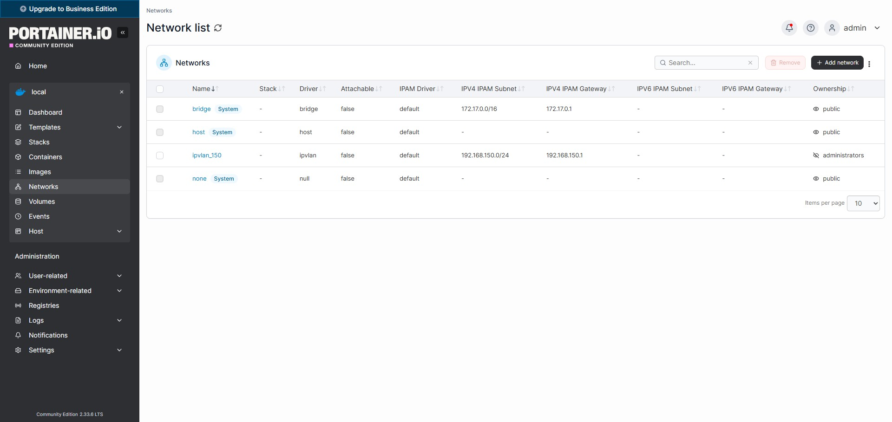

# IPVLAN e VLAN Tagging (802.1Q)

Questa guida documenta la configurazione di un container Docker su un Raspberry Pi, utilizzando il driver di rete ipvlan in modalità L2 su una VLAN specifica (802.1Q)

Questo setup è ideale per ambienti di rete avanzati ("Enterprise" o Lab domestici con switch gestiti) dove si desidera isolare il traffico DNS su una VLAN dedicata, mantenendo il container accessibile direttamente sulla rete fisica senza NAT

---

## Teoria

1. Perché usare `ipvlan` invece di `bridge`?
La modalità standard di Docker (`bridge`) utilizza il NAT. Questo nasconde l'IP reale del client che fa la richiesta DNS, facendo sembrare che tutto il traffico provenga dal Gateway di Docker
Con ipvlan (L2 mode):
- Il container ottiene un IP reale sulla rete fisica (o VLAN)
- Pi-hole può vedere il vero IP del client (fondamentale per statistiche e log)
- Le prestazioni sono leggermente superiori in quanto si evita il bridge software

2. VLAN Tagging (802.1Q)
In questo scenario, non colleghiamo il container alla rete "flat" (non taggata), ma a una specifica VLAN (ID 150)
Affinché funzioni:
- L'interfaccia fisica del Raspberry Pi deve creare una sotto-interfaccia virtuale che "tagga" i pacchetti in uscita
- Requisito Hardware: La porta dello switch a cui è collegato il Raspberry Pi deve essere configurata come TRUNK (o deve avere la VLAN 150 come Tagged). Se lo switch è in modalità Access (solo traffico non taggato), questa configurazione non funzionerà

---

## Configurazione Passo-Passo

### Preparazione dell'Interfaccia Host (Linux)

Prima di iniziare, identifichiamo il nome dell'interfaccia fisica principale (nel mio caso è end0):
```bash
ip a

...
2: end0: <BROADCAST,MULTICAST,UP,LOWER_UP> mtu 1500 qdisc fq_codel state UP group default qlen 1000
link/ether 2c:cf:67:b2:47:ea brd ff:ff:ff:ff:ff:ff
altname enx2ccf67b247ea
inet 192.168.0.102/24 metric 100 brd 192.168.0.255 scope global end0
    valid_lft forever preferred_lft forever
inet6 fe80::2ecf:67ff:feb2:47ea/64 scope link proto kernel_ll
    valid_lft forever preferred_lft forever
...
```

Prima di configurare Docker, il sistema operativo (Linux/Raspberry Pi OS) deve essere consapevole dell'esistenza della VLAN. Creiamo una sotto-interfaccia virtuale legata all'interfaccia fisica

```bash
# Sostituire "eth0" con il nome reale della tua interfaccia (controlla con "ip a")

# 1. Creare l'interfaccia virtuale per la VLAN 150
sudo ip link add link eth0 name eth0.150 type vlan id 150

# 2. Attivare l'interfaccia
sudo ip link set eth0.150 up
```

Verifichiamo che la nuova interfaccia end0.150 sia attiva:

```bash
ip a

...
9: end0.150@end0: <BROADCAST,MULTICAST,UP,LOWER_UP> mtu 1500 qdisc noqueue state UP group default qlen 1000
link/ether 2c:cf:67:b2:47:ea brd ff:ff:ff:ff:ff:ff
inet6 fe80::2ecf:67ff:feb2:47ea/64 scope link proto kernel_ll
    valid_lft forever preferred_lft forever
```

---

### Creazione della Rete Docker (IPVLAN)

Ora istruiamo Docker a creare una rete che si appoggia a quella specifica sotto-interfaccia VLAN appena creata

```bash
docker network create -d ipvlan \
    --subnet=192.168.150.0/24 \
    --gateway=192.168.150.1 \
    -o parent=eth0.150 \
    -o ipvlan_mode=l2 \
    ipvlan_150
```

```bash
-d ipvlan: Specifica il driver

--subnet: La sottorete definita per la VLAN 150

-o parent=eth0.150: Punto cruciale, collega la rete Docker all'interfaccia VLAN taggata, non a quella fisica grezza

-o ipvlan_mode=l2: Modalità Layer 2 (condivide il MAC address del padre ma ha IP diverso)
```



---

### Test del corretto funzionamento

Avviamo un container temporaneo (Alpine Linux) per verificare che l'IP venga assegnato correttamente e che la rete sia raggiungibile

```bash
docker run \
-it --net ipvlan_10 \
--ip 192.168.150.69 \
--name test1 \
-v alpine:/data alpine /bin/sh
```

Una volta dentro la shell del container, controlliamo l'indirizzo IP assegnato:

```bash
/ # ip a                                                                                                                
1: lo: <LOOPBACK,UP,LOWER_UP> mtu 65536 qdisc noqueue state UNKNOWN qlen 1000
link/loopback 00:00:00:00:00:00 brd 00:00:00:00:00:00
inet 127.0.0.1/8 scope host lo
    valid_lft forever preferred_lft forever
inet6 ::1/128 scope host
    valid_lft forever preferred_lft forever                      

10: eth0@if9: <BROADCAST,MULTICAST,UP,LOWER_UP,M-DOWN> mtu 1500 qdisc noqueue state UNKNOWN
link/ether 2c:cf:67:b2:47:ea brd ff:ff:ff:ff:ff:ff
inet 192.168.150.69/24 brd 192.168.150.255 scope global eth0
    valid_lft forever preferred_lft forever 
```

Proviamo infine a pingare il Gateway per confermare la connettività:

```bash
ping 192.168.150.1
```


---

### Deploy del Container (Esempio con Pi-hole)

Se il test è positivo, avviamo il container definitivo assegnandogli un IP statico all'interno della VLAN 150

Comando Docker Run:

```bash
docker run -d \
    --name pihole \
    --restart=always \
    --net ipvlan_150 \
    --ip 192.168.150.69 \
    -v /etc/pihole:/etc/pihole \
    -v /etc/dnsmasq.d:/etc/dnsmasq.d \
    --cap-add=NET_ADMIN \
    -e TZ="Europe/Rome" \
    pihole/pihole:latest
```

Oppure possiamo creare uno stack dalla gui del brouser

```bash
services:
  pihole:
    container_name: pihole
    image: pihole/pihole:latest
    hostname: pihole
    ports:
      - "53:53/tcp"
      - "53:53/udp"
      - "67:67/udp"
      - "80:80/tcp"
      - "443:443/tcp"
    environment:
      TZ: 'Europe/Amsterdam'
      FTLCONF_dns_listeningMode: all
    volumes:
    - '/home/vikash/pihole:/etc/pihole'
    cap_add:
    - NET_ADMIN
    restart: unless-stopped
```

---

### Migrazione del Container sulla Rete VLAN

Attualmente, il container Pi-hole è in esecuzione sulla rete di default bridge. Questo significa che condivide l'indirizzo IP dell'host tramite NAT, invece di trovarsi isolato sulla VLAN desiderata

Per spostare il container sulla rete ipvlan_150 e assegnargli un IP dedicato, seguire questi passaggi nell'interfaccia di Portainer:

- Dalla lista dei container, cliccare sul nome del container interessato (pihole)
- Cliccare sul pulsante Duplicate/Edit situato nella barra in alto a destra
- Scorrere verso il basso fino alla sezione Network
- Alla voce "Network", rimuovere bridge e selezionare ipvlan_150
- Importante: Cancellare il contenuto del campo MAC Address
    - Nota: è fondamentale rimuovere il vecchio MAC address per permettere a Docker di generarne uno nuovo valido per la nuova rete, evitando conflitti ARP
- Nel campo IPv4 Address, inserire l'IP statico desiderato per il container (es. 192.168.150.8)
- Cliccare su "Deploy the container" e confermare con Replace quando richiesto

Extra: controlliamo con comando `ping` se tutto funziona correttamente, ossia ne verifichiamo la connettività

---

## Limitazioni e Troubleshooting

1. Isolamento Host-Container

Per design di sicurezza del kernel Linux, quando si usa macvlan o ipvlan: L'Host (il Raspberry Pi) NON può comunicare con i container sulla sua stessa interfaccia

Il Raspberry Pi (es. 192.168.0.10) non potrà fare il ping a Pi-hole (192.168.150.69)

Tutti gli altri dispositivi della rete (PC, Smartphone, Router) potranno raggiungerlo perfettamente

2. Configurazione Switch

Se il container non risponde al ping:

Verificare che la porta dello switch sia configurata per accettare traffico Tagged VLAN 150

Se si usa uno switch "stupido" (unmanaged), questa configurazione fallirà perché lo switch dropperà i pacchetti taggati o non saprà dove mandarli