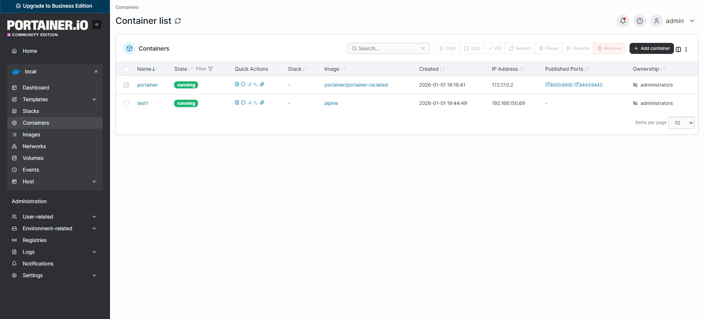

>  [Italiano](installazione.md) |  **English**

# Step-by-Step Configuration

## Step 1: Identify the Network Interface

```bash
ip a
```

On a Raspberry Pi 5 with Bookworm, the Ethernet interface is typically named `end0` (not `eth0` as on previous models):

```
2: end0: <BROADCAST,MULTICAST,UP,LOWER_UP> mtu 1500 qdisc fq_codel state UP group default qlen 1000
    link/ether 2c:cf:67:b2:47:ea brd ff:ff:ff:ff:ff:ff
    altname enx2ccf67b247ea
    inet 192.168.0.102/24 metric 100 brd 192.168.0.255 scope global end0
        valid_lft forever preferred_lft forever
```

## Step 2: Create the VLAN Sub-Interface

Before Docker can use the VLAN, the Linux kernel needs to know it exists. We create a virtual sub-interface that "tags" packets with VLAN ID 150:

```bash
# Crea l'interfaccia virtuale per VLAN 150
sudo ip link add link end0 name end0.150 type vlan id 150

# Attiva l'interfaccia
sudo ip link set end0.150 up
```

**What happens at the kernel level:**

- `ip link add`: creates a virtual network device of type `vlan`
- `link end0`: the sub-interface is a "child" of the physical interface `end0`
- `type vlan id 150`: every outgoing frame from `end0.150` is automatically tagged with VLAN ID 150. Every incoming frame on `end0` with tag 150 is delivered to `end0.150`

### Verification

```bash
ip a
```

```
9: end0.150@end0: <BROADCAST,MULTICAST,UP,LOWER_UP> mtu 1500 qdisc noqueue state UP group default qlen 1000
    link/ether 2c:cf:67:b2:47:ea brd ff:ff:ff:ff:ff:ff
    inet6 fe80::2ecf:67ff:feb2:47ea/64 scope link proto kernel_ll
        valid_lft forever preferred_lft forever
```

The `end0.150@end0` interface is active. Note that it does not have an IPv4 address - it does not need one, Docker will manage the container IPs.

> **Persistence:** This configuration is lost on reboot. To make it permanent, add to the file `/etc/network/interfaces.d/vlan150`:
> ```
> auto end0.150
> iface end0.150 inet manual
>     vlan-raw-device end0
> ```

## Step 3: Create the Docker IPVLAN Network

```bash
docker network create -d ipvlan \
    --subnet=192.168.150.0/24 \
    --gateway=192.168.150.1 \
    -o parent=end0.150 \
    -o ipvlan_mode=l2 \
    ipvlan_150
```

Explanation of each parameter:

| Parameter | Meaning |
|---|---|
| `-d ipvlan` | Network driver: IPVLAN |
| `--subnet=192.168.150.0/24` | The VLAN 150 subnet |
| `--gateway=192.168.150.1` | The VLAN gateway (must exist on the switch/router) |
| `-o parent=end0.150` | **Critical point:** binds the Docker network to the VLAN sub-interface, NOT to the physical interface |
| `-o ipvlan_mode=l2` | Layer 2 mode: shares the host's MAC, operates as a direct bridge |


## Step 4: Connectivity Test

Launch a temporary container to verify the IP is assigned correctly:

```bash
docker run -it --rm \
    --net ipvlan_150 \
    --ip 192.168.150.69 \
    --name test-vlan \
    alpine /bin/sh
```

Inside the container:

```bash
# Verifica IP assegnato
ip a
```

```
1: lo: <LOOPBACK,UP,LOWER_UP> mtu 65536 qdisc noqueue state UNKNOWN qlen 1000
    link/loopback 00:00:00:00:00:00 brd 00:00:00:00:00:00
    inet 127.0.0.1/8 scope host lo
        valid_lft forever preferred_lft forever

10: eth0@if9: <BROADCAST,MULTICAST,UP,LOWER_UP,M-DOWN> mtu 1500 qdisc noqueue state UNKNOWN
    link/ether 2c:cf:67:b2:47:ea brd ff:ff:ff:ff:ff:ff
    inet 192.168.150.69/24 brd 192.168.150.255 scope global eth0
        valid_lft forever preferred_lft forever
```

The container has IP `192.168.150.69` on VLAN 150 and shares the host's MAC address (`2c:cf:67:b2:47:ea`).

```bash
# Test connettività verso il gateway
ping 192.168.150.1
```



If the ping works, the VLAN is configured correctly end-to-end (Raspberry Pi → switch → router).

### Verification with tcpdump: Observing Tagged Frames

To confirm that frames are actually going out with the 802.1Q tag, capture traffic on the **physical** interface (not on the VLAN sub-interface):

```bash
sudo tcpdump -i end0 -e -n vlan 150
```

| Flag | Meaning |
|---|---|
| `-i end0` | Capture on the physical interface (where frames are still tagged) |
| `-e` | Show Ethernet headers (source/destination MAC) |
| `-n` | Do not resolve DNS names (faster and more readable) |
| `vlan 150` | Filter only frames with VLAN ID 150 tag |

Output during a ping from the container:

```
14:23:01.234567 2c:cf:67:b2:47:ea > ff:ff:ff:ff:ff:ff, ethertype 802.1Q (0x8100),
    length 46: vlan 150, p 0, ethertype ARP (0x0806),
    Request who-has 192.168.150.1 tell 192.168.150.69, length 28

14:23:01.235012 aa:bb:cc:dd:ee:ff > 2c:cf:67:b2:47:ea, ethertype 802.1Q (0x8100),
    length 46: vlan 150, p 0, ethertype ARP (0x0806),
    Reply 192.168.150.1 is-at aa:bb:cc:dd:ee:ff, length 28

14:23:01.235234 2c:cf:67:b2:47:ea > aa:bb:cc:dd:ee:ff, ethertype 802.1Q (0x8100),
    length 102: vlan 150, p 0, ethertype IPv4 (0x0800),
    192.168.150.69 > 192.168.150.1: ICMP echo request, id 1, seq 1, length 64

14:23:01.236789 aa:bb:cc:dd:ee:ff > 2c:cf:67:b2:47:ea, ethertype 802.1Q (0x8100),
    length 102: vlan 150, p 0, ethertype IPv4 (0x0800),
    192.168.150.1 > 192.168.150.69: ICMP echo reply, id 1, seq 1, length 64
```

**Reading the output:**

1. **Frame 1 (ARP Request)**: the container (MAC `2c:cf:67:b2:47:ea` - the host's MAC, because IPVLAN) sends a broadcast ARP to resolve the MAC of gateway `192.168.150.1`. The `ethertype 802.1Q (0x8100)` field confirms that the frame is tagged, and `vlan 150` shows the correct VLAN ID
2. **Frame 2 (ARP Reply)**: the gateway responds with its MAC (`aa:bb:cc:dd:ee:ff`)
3. **Frames 3-4 (ICMP)**: the actual ping, encapsulated in 802.1Q frames with VLAN 150

If you capture on the VLAN sub-interface (`-i end0.150`), the frames appear **without** the 802.1Q tag - the kernel has already removed (de-tagged) them before delivering to the sub-interface. This is expected behavior: tagging/de-tagging happens between `end0` and `end0.150`.

> **Diagnostics**: if `tcpdump -i end0 vlan 150` shows nothing during a ping from the container, the frames are not going out tagged. Verify that the sub-interface `end0.150` is UP and that the Docker network uses `parent=end0.150` (not `parent=end0`).

## Step 5: Deploy a Container on the VLAN (Example: Pi-hole)

```bash
docker run -d \
    --name pihole \
    --restart=always \
    --net ipvlan_150 \
    --ip 192.168.150.69 \
    -v /etc/pihole:/etc/pihole \
    -v /etc/dnsmasq.d:/etc/dnsmasq.d \
    --cap-add=NET_ADMIN \
    -e TZ="Europe/Rome" \
    pihole/pihole:latest
```

Or via Docker Compose (from Portainer → Stacks → Add Stack):

```yaml
services:
  pihole:
    container_name: pihole
    image: pihole/pihole:latest
    hostname: pihole
    networks:
      ipvlan_150:
        ipv4_address: 192.168.150.69
    environment:
      TZ: 'Europe/Rome'
      FTLCONF_dns_listeningMode: all
    volumes:
      - '/home/pi/pihole/etc-pihole:/etc/pihole'
      - '/home/pi/pihole/etc-dnsmasq:/etc/dnsmasq.d'
    cap_add:
      - NET_ADMIN
    restart: unless-stopped

networks:
  ipvlan_150:
    external: true
```

> **Note:** The `ipvlan_150` network is declared as `external: true` because we already created it manually with `docker network create`. Docker Compose must not attempt to recreate it.

## Migrating an Existing Container from Bridge to VLAN

If you already have a Pi-hole container running on the bridge network and want to move it to IPVLAN, you can do it from Portainer:

1. From the container list, click on the container name (`pihole`)
2. Click **Duplicate/Edit** in the top bar
3. In the **Network** section:
   - Remove `bridge`
   - Select `ipvlan_150`
   - **Important:** Clear the **MAC Address** field - Docker must generate a new one for the new network. Leaving the old MAC causes ARP conflicts
   - In the **IPv4 Address** field, enter the static IP (e.g., `192.168.150.69`)
4. Click **Deploy the container** and confirm with **Replace**
